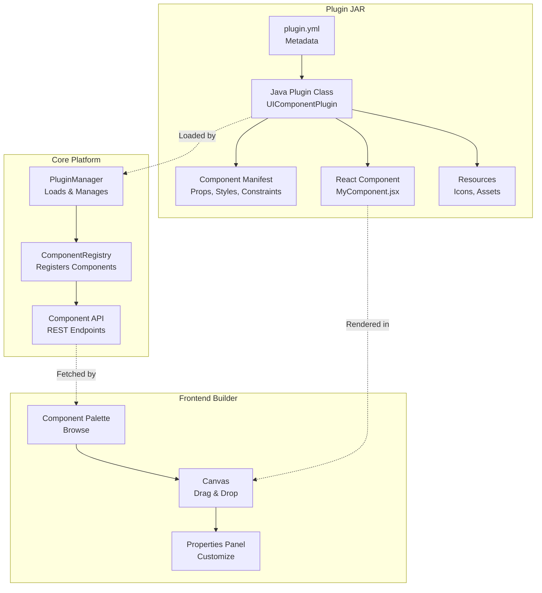
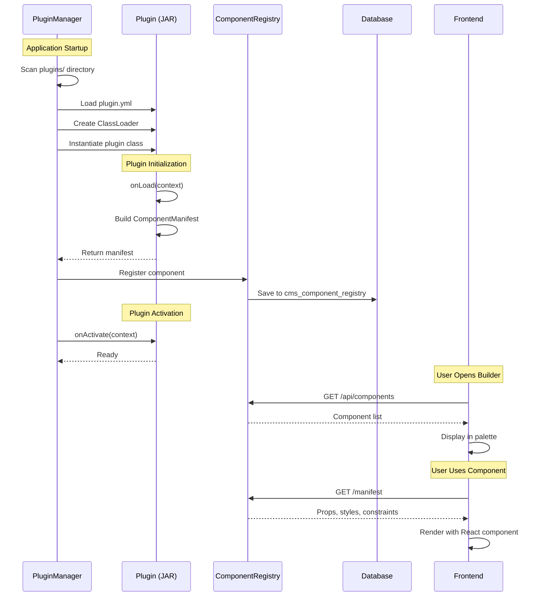
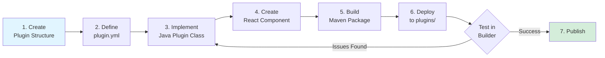
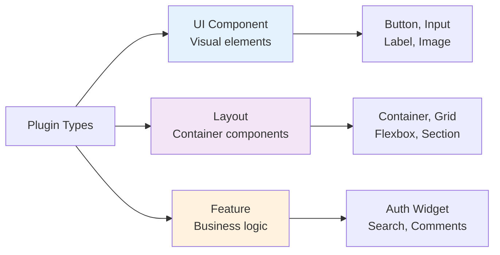
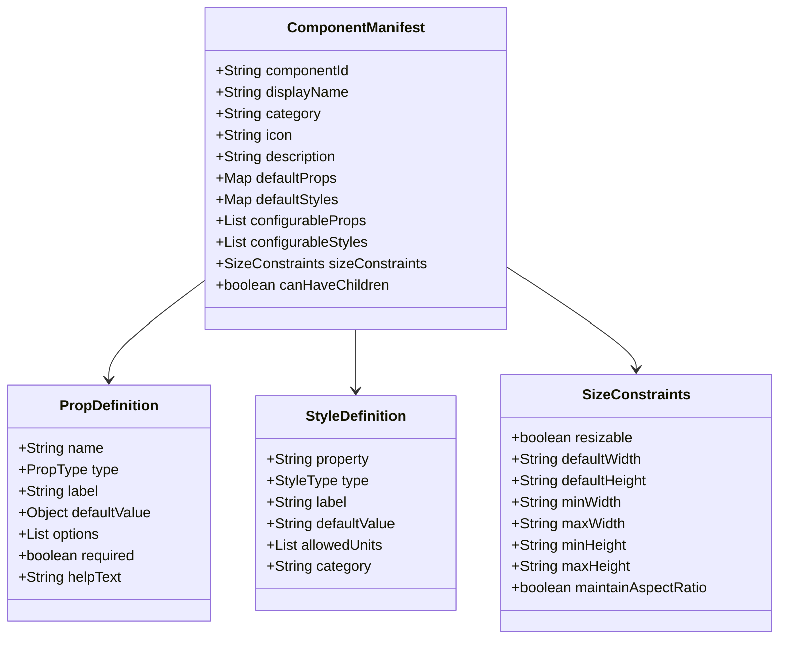
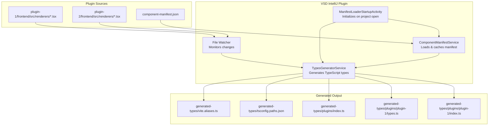
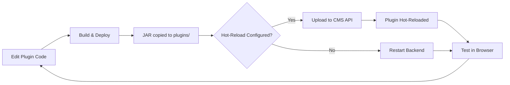
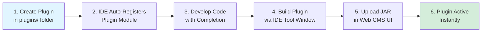

# Visual Site Builder Platform

A plugin-based visual site builder platform with drag-and-drop components, live CSS editing, and extensible architecture.

---

## Table of Contents

**Getting Started**

- [Chapter 1: Quick Start](#chapter-1-quick-start)
- [Chapter 2: Running the Application](#chapter-2-running-the-application)

**Using the Builder**

- [Chapter 3: Builder Features](#chapter-3-builder-features)
- [Chapter 3.1: Content Repository](#chapter-31-content-repository)
- [Chapter 3.2: UI Templates](#chapter-32-ui-templates)
- [Chapter 3.3: Multi-Page Sites](#chapter-33-multi-page-sites)
- [Chapter 3.4: Static Export](#chapter-34-static-export)
- [Chapter 3.5: Thymeleaf/Spring Boot Export](#chapter-35-thymeleafspring-boot-export)
- [Chapter 3.6: Data Binding and Dynamic Components](#chapter-36-data-binding-and-dynamic-components)
- [Chapter 3.7: Authentication Components](#chapter-37-authentication-components)

**Plugin Development**

- [Chapter 4: Plugin Development Basics](#chapter-4-plugin-development-basics)
- [Chapter 4.1: Component Capabilities System](#chapter-41-component-capabilities-system)
- [Chapter 5: Developing Dynamic Components](#chapter-5-developing-dynamic-components)
- [Chapter 6: Plugin Management](#chapter-6-plugin-management)
- [Chapter 6.1: Plugin Frontend Architecture](#chapter-61-plugin-frontend-architecture)
- [Chapter 6.2: Component Administration UI](#chapter-62-component-administration-ui)

**Shipped Plugins**

- [Chapter 7: Shipped Plugins Reference](#chapter-7-shipped-plugins-reference)

**IDE Tooling**

- [Chapter 8: VSD IntelliJ Plugin](#chapter-8-vsd-intellij-plugin)

**Advanced Plugin Development**

- [Chapter 9: Developing Compound Plugins](#chapter-9-developing-compound-plugins)

**Reference**

- [Chapter 10: Architecture](#chapter-10-architecture)
- [Chapter 11: API Reference](#chapter-11-api-reference)
- [Chapter 12: Troubleshooting](#chapter-12-troubleshooting)

---

## Chapter 1: Quick Start

### Prerequisites

- **Java**: JDK 21 or higher
- **Maven**: 3.6+
- **Node.js**: 20.10.0+ (for frontend)
- **npm**: 10.2.3+

### Run the Application

```bash
# 1. Build and start backend (includes frontend build)
cd core
mvn spring-boot:run

# Backend runs on: http://localhost:8080
# Frontend served at: http://localhost:8080

# 2. For development with hot reload, start frontend separately:
cd frontend
npm install
npm run dev

# Frontend dev server: http://localhost:5173 or http://localhost:5174
```

### Access the Builder

Open your browser and navigate to:
- **Production**: http://localhost:8080
- **Development**: http://localhost:5173/builder/new

You'll see the Visual Site Builder with:
- **Component Palette** (left) - Available UI components
- **Canvas** (center) - Drag-and-drop workspace
- **Properties Panel** (right) - Component customization

---

## Chapter 2: Running the Application

### Backend Only

```bash
cd core
mvn clean install -DskipTests
mvn spring-boot:run
```

**Configuration** (`core/src/main/resources/application.properties`):
```properties
# Server
server.port=8080

# Database (H2 embedded)
spring.datasource.url=jdbc:h2:file:./data/flashcarddb

# Plugin System
app.plugin.directory=plugins
app.plugin.hot-reload.enabled=true
app.plugin.validation.enabled=true
```

### Frontend Only (Development)

```bash
cd frontend
npm install
npm run dev
```

### Production Build

```bash
cd core
mvn clean package -DskipTests

# Run the JAR
java -jar target/core-1.0.0-SNAPSHOT.jar
```

### Database Management

Access H2 Console at: http://localhost:8080/h2-console

**Connection Details**:
- JDBC URL: `jdbc:h2:file:./data/flashcarddb`
- Username: `sa`
- Password: (empty)

---

## Chapter 3: Builder Features

The Visual Site Builder provides a comprehensive interface for creating and managing pages with drag-and-drop components.

### Properties Panel

The Properties Panel (right sidebar) allows you to customize selected components with four tabs:

#### Props Tab

Configure component-specific properties like text content, colors, variants, and sizes.

#### Styles Tab

Edit CSS styles including:

- **Colors**: Background, text, and border colors with color picker
- **Spacing**: Padding and margin values
- **Typography**: Font size, weight, and family
- **Borders**: Border width, style, and radius

#### Layout Tab

Control component positioning:

- **Position**: Grid column and row placement
- **Size**: Width and height (supports px, %, auto)
- **Span**: Column and row span for grid layouts
- **Z-Index**: Layer ordering

#### Events Tab

Add interactivity to components:

**Available Event Types:**

- `onClick` - Triggered when component is clicked
- `onDoubleClick` - Triggered on double-click
- `onMouseEnter` - Triggered when mouse enters component
- `onMouseLeave` - Triggered when mouse leaves component
- `onFocus` - Triggered when component receives focus
- `onBlur` - Triggered when component loses focus
- `onChange` - Triggered when value changes (inputs)
- `onSubmit` - Triggered on form submission

**Available Actions:**

| Action | Description | Config Fields |
|--------|-------------|---------------|
| Navigate | Go to a URL | `url` |
| Show Message | Display alert/toast | `message`, `type` (info/success/warning/error) |
| Call Backend API | Invoke server handler | `endpoint`, `method` (GET/POST/PUT/DELETE) |
| Toggle Visibility | Show/hide component | `targetComponentId` |
| Update Property | Change another component's prop | `targetComponentId`, `propName`, `value` |
| Submit Form | Submit a form | `formId` |
| Open Modal | Open a modal dialog | `modalId` |
| Close Modal | Close a modal dialog | `modalId` |
| Emit Custom Event | Trigger custom event | `eventName`, `eventData` |
| Custom Code | Execute JavaScript | `code` |

**Event Options:**

- **Prevent Default**: Stops the browser's default behavior
- **Stop Propagation**: Prevents event bubbling to parent elements
- **Preview Mode Only**: Event only fires in preview mode, not edit mode

### Keyboard Shortcuts

| Shortcut | Action |
|----------|--------|
| `Ctrl+S` / `Cmd+S` | Save page |
| `Ctrl+Z` / `Cmd+Z` | Undo |
| `Ctrl+Shift+Z` / `Cmd+Shift+Z` | Redo |
| `Ctrl+E` / `Cmd+E` | Toggle CSS Editor |
| `Delete` | Remove selected component |
| `Escape` | Close panels/modals |

### Saving and Loading

**With Backend Connection:**
Pages are saved to the database when you have a valid `siteId` and `pageId` in the URL (e.g., `/builder/1/2`).

**Demo Mode (localStorage):**
When no backend connection is available, pages are automatically saved to browser localStorage:

- Pages persist across browser sessions
- Last saved page loads automatically on startup
- Export pages as JSON for backup

### Preview Mode

Toggle between Edit and Preview modes using the toolbar button:

- **Edit Mode**: Full editing capabilities with selection, drag-drop, resize handles
- **Preview Mode**: See how the page looks to end users, events are active

---

## Chapter 3.1: Content Repository

The Content Repository allows you to upload, manage, and use media files (images, videos, PDFs) within your site builder projects.

### Accessing the Content Repository

1. Click the **"📁 Content"** button in the builder toolbar (center section)
2. Select **"🖼️ Image Repository"** from the dropdown menu
3. The Image Repository modal will open

### Image Repository Features

#### Uploading Images

**Drag and Drop:**
- Drag image files directly onto the upload zone
- Multiple files can be uploaded at once

**Click to Browse:**
- Click the upload zone to open a file browser
- Select one or multiple images

**Supported Formats:**
- JPEG (.jpg, .jpeg)
- PNG (.png)
- GIF (.gif)
- WebP (.webp)
- SVG (.svg)

**File Size Limit:** 50MB per file

#### Viewing Images

The Image Repository displays all uploaded images in a grid view with:
- Thumbnail preview
- Original filename
- File size
- Image dimensions (width × height)

#### Using Images

**Copy URL:**
1. Hover over an image card
2. Click the 📋 (copy) button
3. The image URL is copied to clipboard
4. Paste the URL into an Image component's `src` property

**View Details:**
1. Click on an image to select it
2. The "Selected Image" section shows:
   - Larger preview
   - Full filename
   - Size, dimensions, and MIME type
   - Copyable URL field

#### Deleting Images

1. Hover over an image card
2. Click the 🗑️ (delete) button
3. Confirm the deletion

### Using Images in Components

After uploading images to the repository:

1. Add an **Image** component to your page (from the Components palette)
2. Select the Image component
3. In the Properties Panel, find the **"Image URL"** field
4. Paste the copied URL from the Image Repository

### Content Repository API

The Content Repository also provides a REST API for programmatic access:

```http
# Upload a file
POST /api/content/upload
Content-Type: multipart/form-data
Body: file (multipart), folder (optional)

# Get all images
GET /api/content/images
GET /api/content/images?folder=subfolder

# Get all content (with optional filters)
GET /api/content?type=image&folder=uploads

# Get specific content item
GET /api/content/{id}

# Delete content
DELETE /api/content/{id}

# Get repository statistics
GET /api/content/stats

# Get all folders
GET /api/content/folders

# Create folder
POST /api/content/folders?path=new-folder
```

### Configuration

Content repository settings in `application.properties`:

```properties
# Upload directory (relative to application root)
app.content.upload-dir=uploads

# Base URL for serving uploaded files
app.content.base-url=/uploads
```

---

## Chapter 3.2: UI Templates

UI Templates provide pre-built page layouts that you can use as starting points for your pages. Instead of building from scratch, select a template and customize it.

### Accessing Templates

1. In the builder, click the **"Templates"** tab in the left sidebar
2. Browse available templates by category
3. Click a template to preview it
4. Click **"Use Template"** to apply it to your canvas

### Available Templates

#### Business Homepage

A professional business landing page with:
- Navigation bar with logo and menu items
- Hero section with heading, subheading, and CTA button
- Features section with 3-column grid
- Call-to-action section
- Footer with copyright

**Best for:** Corporate websites, service businesses, agencies

#### Startup Landing Page

A modern startup-focused landing page with:
- Minimal navbar
- Bold hero section with gradient background
- Feature highlights
- Testimonial/social proof section
- Email signup form
- Minimal footer

**Best for:** SaaS products, tech startups, app launches

#### Personal About Me

A personal profile/portfolio page with:
- Centered profile image (circular)
- Name and title heading
- Bio/about text
- Skills or expertise section
- Contact information
- Social links

**Best for:** Personal portfolios, freelancer profiles, resumes

#### Creative Portfolio

A showcase portfolio with:
- Artistic navbar
- Hero with tagline
- Project gallery grid with images
- **Team section** with profiles (CEO, CTO, Lead Architect)
- Contact section

**Best for:** Design agencies, creative professionals, studios

#### Contact Page

A dedicated contact page with:
- Page header
- Contact form (name, email, message fields)
- Contact information sidebar
- Map placeholder
- Business hours

**Best for:** Contact pages, support pages

### Template Components

Templates use built-in components with pre-configured properties:

| Component | Description | Key Properties |
|-----------|-------------|----------------|
| **Navbar** | Navigation bar | brandText, navItems, layout, sticky |
| **Container** | Layout container | layoutType, padding, maxWidth, gap |
| **Label** | Text/headings | text, variant (h1-h6, p), textAlign |
| **Button** | Call-to-action | text, variant, size, fullWidth |
| **Textbox** | Form inputs | label, placeholder, type, required |
| **Image** | Media display | src, alt, aspectRatio, objectFit |

### Customizing Templates

After applying a template:

1. **Select components** by clicking on them
2. **Edit properties** in the Properties Panel (right sidebar)
3. **Modify styles** using the Styles tab
4. **Add/remove components** from the Components palette
5. **Rearrange** by dragging components
6. **Resize** using drag handles

### Image Component

The Image component displays images with various options:

**Configurable Properties:**

| Property | Type | Default | Description |
|----------|------|---------|-------------|
| `src` | URL | "" | Image source URL |
| `alt` | String | "Image" | Alt text for accessibility |
| `objectFit` | Select | "cover" | How image fits: cover, contain, fill, none |
| `objectPosition` | Select | "center" | Image position within container |
| `aspectRatio` | Select | "auto" | Aspect ratio: auto, 1:1, 4:3, 16:9, circle |
| `borderRadius` | Size | "0px" | Corner rounding |
| `placeholder` | Select | "icon" | Placeholder type when no src: icon, color |
| `placeholderColor` | Color | "#e9ecef" | Background color for placeholder |
| `caption` | String | "" | Image caption text |
| `showCaption` | Boolean | false | Show caption below image |
| `lazyLoad` | Boolean | true | Enable lazy loading |

**Aspect Ratio Options:**
- `auto` - Natural image dimensions
- `1:1` - Square
- `4:3` - Standard photo
- `16:9` - Widescreen
- `3:2` - Classic photo
- `2:3` - Portrait
- `circle` - Circular crop (with 1:1 ratio)

**Usage Example:**

```jsx
// Profile image with circular crop
<Image
  src="/uploads/profile.jpg"
  alt="John Doe - CEO"
  aspectRatio="circle"
  objectFit="cover"
  placeholderColor="#dee2e6"
/>

// Hero banner with 16:9 aspect ratio
<Image
  src="/uploads/hero-banner.jpg"
  alt="Welcome to our site"
  aspectRatio="16:9"
  objectFit="cover"
  borderRadius="8px"
/>
```

### Creating Custom Templates

While the platform ships with built-in templates, you can create your own:

1. Build your page layout in the builder
2. Configure all components with desired properties
3. Export the page definition as JSON (`Export` button)
4. Save the JSON as a template file

Template JSON structure:

```json
{
  "id": "my-custom-template",
  "name": "My Custom Template",
  "description": "A custom template for...",
  "category": "custom",
  "thumbnail": "/templates/my-template-thumb.png",
  "components": [
    {
      "pluginId": "core-ui",
      "componentId": "Label",
      "props": {
        "text": "Welcome",
        "variant": "h1"
      },
      "styles": {
        "textAlign": "center"
      }
    }
    // ... more components
  ]
}
```

---

## Chapter 3.3: Multi-Page Sites

The Visual Site Builder supports creating multi-page websites with navigation between pages. This chapter covers page management, inter-page linking, and multi-page preview.

### Page Management

#### Accessing the Page Manager

1. In the builder, click the **"Pages"** tab in the left sidebar
2. The Page Manager displays all pages in your site
3. Current page is highlighted with a blue border

#### Creating Pages

**From the Page Manager:**

1. Click **"+ New"** button in the Page Manager header
2. Enter a **Page Name** (e.g., "About Us")
3. Enter a **URL Slug** (auto-generated from name, e.g., "about-us")
4. Click **"Create Page"**

The new page opens in the editor with an empty canvas.

#### Page Operations

Right-click on any page or click the **⋮** menu button to access:

| Action | Description |
|--------|-------------|
| **Rename** | Change the page name |
| **Duplicate** | Create a copy of the page with all components |
| **Set as Homepage** | Make this page the site's root (/) page |
| **Delete** | Permanently remove the page |

#### Page Types

| Type | Icon | Description |
|------|------|-------------|
| **Homepage** | 🏠 | The main landing page, accessible at `/` |
| **Standard** | 📄 | Regular content pages |
| **Template** | 📐 | Reusable page layouts |

### Linking to Pages

#### Using the Navigation Editor

When editing a **Navbar** component's navigation items:

1. Select the Navbar component
2. In Properties panel, find **"Navigation Items"**
3. Click **"Edit"** on a navigation item
4. In the **"Link"** field, use the **Page Link Selector**:
   - **Internal Page** tab: Select from your site's pages
   - **External URL** tab: Enter any external URL

#### Link Selector Features

The Page Link Selector provides:

- **Section Links**: Link to current page (#) or top of page (#top)
- **Site Pages**: All pages with their paths (e.g., /about, /contact)
- **External URLs**: Full URLs for external sites

#### Button Navigation

To make a button navigate to a page:

1. Select the Button component
2. Go to **Events** tab in Properties panel
3. Add **"On Click"** event
4. Set Action to **"Navigate to URL"**
5. Use the Page Link Selector to choose a page

### Multi-Page Preview

#### Entering Preview Mode

1. Click **"👁 Preview"** in the toolbar
2. The Multi-Page Preview opens with a browser-like interface

#### Preview Toolbar Features

| Feature | Description |
|---------|-------------|
| **← →** Navigation | Go back/forward through visited pages |
| **Address Bar** | Shows current page path (preview://path) |
| **Page Selector** | Dropdown to jump to any page |
| **Exit Preview** | Return to edit mode |

#### Navigating in Preview

- **Click navbar links** to navigate between pages
- **Click buttons** with navigation actions
- **Use the dropdown** to jump to any page directly
- **Back/Forward buttons** work like a browser

#### How Navigation Works

Internal links (starting with `/`) are intercepted:
- Page is loaded from cache or fetched
- Canvas re-renders with new page content
- Navigation history is updated

External links (https://) open in a new browser tab.

### Page URL Structure

Pages have the following URL patterns:

| Page | Route Path | Access URL |
|------|------------|------------|
| Home | `/` | `https://yoursite.com/` |
| About | `/about` | `https://yoursite.com/about` |
| Contact | `/contact` | `https://yoursite.com/contact` |
| Services | `/services` | `https://yoursite.com/services` |

### Best Practices

#### Page Organization

1. **Use clear, descriptive page names** - "About Us" not "Page 2"
2. **Keep URLs short and meaningful** - `/about` not `/about-our-company-and-team`
3. **Set your homepage first** - It's the entry point for visitors

#### Navigation Design

1. **Include all important pages in navbar** - Users expect main navigation
2. **Use consistent navigation** - Same navbar on all pages
3. **Add breadcrumbs for deep pages** - Help users understand location

#### Multi-Page Preview Tips

1. **Test all navigation paths** - Click through all links
2. **Check mobile responsiveness** - Navbar may collapse on mobile
3. **Verify external links** - They should open in new tabs

### Demo Mode (No Backend)

When running without a backend (demo mode):

- Pages are stored in **localStorage**
- Each page saves automatically with its slug as key
- Multi-page preview loads pages from localStorage
- Perfect for prototyping and testing

### API Reference

#### Page Endpoints

```http
# List all pages
GET /api/sites/{siteId}/pages

# Get single page
GET /api/sites/{siteId}/pages/{pageId}

# Create page
POST /api/sites/{siteId}/pages
Content-Type: application/json
{
  "pageName": "About Us",
  "pageSlug": "about",
  "pageType": "standard",
  "routePath": "/about"
}

# Update page
PUT /api/sites/{siteId}/pages/{pageId}

# Delete page
DELETE /api/sites/{siteId}/pages/{pageId}

# Set as homepage
PUT /api/sites/{siteId}/pages/{pageId}
{ "routePath": "/" }
```

---

## Chapter 3.4: Static Export

The Visual Site Builder allows you to export your site as static HTML/CSS/JS files that can be deployed to any web hosting service. The export preserves all content, styling, and navigation exactly as shown in the preview.

### Accessing the Export Feature

1. Click the **"Export"** button in the builder toolbar
2. The Export Modal opens with configuration options

### Export Options

#### What to Export

| Option | Description |
|--------|-------------|
| **Entire Site** | Exports all pages as a deployable ZIP file |
| **Current Page Only** | Exports the current page as a single HTML file |

#### Site Name

Enter a name for your exported site. This is used for:
- The ZIP filename (e.g., `my-site-site.zip`)
- The README file included in the export

### Export Contents

#### Entire Site (ZIP)

The ZIP export includes:

| File | Description |
|------|-------------|
| `index.html` | Homepage (the page with route `/` or slug `home`) |
| `{page-slug}.html` | HTML file for each additional page |
| `css/styles.css` | Base CSS styles for all components |
| `js/main.js` | JavaScript for interactive features |
| `images/` | All images used in your site (bundled locally) |
| `README.md` | Deployment instructions |

#### Current Page Only (HTML)

Single-page export includes:
- Self-contained HTML file with embedded CSS/JS
- Images embedded as base64 data URLs
- Ready to view in any browser

### How Export Works

#### Style Preservation

The export engine preserves all component styles exactly as configured:

- **Navbar**: Brand name, navigation items, colors, layout mode
- **Containers**: Layout type (flex-row, flex-column, grid), gap, padding
- **Images**: Source URL, alt text, object-fit, border-radius
- **Buttons**: Text, variant, size, click navigation
- **Labels**: Text content, variant (h1-h6, p, span)

#### Navigation Links

Internal navigation links are automatically converted for static hosting:

| Original Route | Exported Link |
|---------------|---------------|
| `/` | `index.html` |
| `/home` | `index.html` |
| `/about` | `about.html` |
| `/contact` | `contact.html` |

External URLs (http/https) and anchor links (#section) remain unchanged.

#### Image Handling

Images are handled based on export type:

**ZIP Export:**
- Images are fetched and bundled in the `images/` folder
- URLs are rewritten to local paths (e.g., `images/photo.jpg`)

**Single Page Export:**
- Images are embedded as base64 data URLs
- Results in a larger file but completely self-contained

### Deployment Options

The export is compatible with any static hosting service:

| Service | How to Deploy |
|---------|---------------|
| **Netlify Drop** | Drag and drop the ZIP folder to [netlify.com/drop](https://app.netlify.com/drop) |
| **GitHub Pages** | Push files to a GitHub repository with Pages enabled |
| **Vercel** | Import from [vercel.com/new](https://vercel.com/new) |
| **Any Web Server** | Upload files via FTP/SFTP |

### Best Practices

#### Before Exporting

1. **Save all pages** - Ensure all changes are saved before export
2. **Test in Preview** - Verify all navigation and styling works
3. **Check images** - Ensure all images are uploaded to Content Repository

#### File Naming

- Homepage is always exported as `index.html`
- Other pages use their URL slug (e.g., `about-us.html`)
- Site ZIP uses the site name you provide

#### Unsaved Changes

If you have unsaved changes, the export modal will:
- Show a warning message
- Automatically save before exporting
- Ensure the latest content is included

### Troubleshooting Export

#### Images Not Appearing

**Problem:** Images show as broken in exported files.

**Solution:**
- Ensure images are uploaded to the Content Repository
- Use the full URL from the repository (starts with `/uploads/`)
- For external images, ensure they allow cross-origin requests

#### Navigation Links Not Working

**Problem:** Clicking navbar links shows "file not found".

**Solution:**
- Ensure all pages are saved before export
- Check that page slugs match the navigation hrefs
- Homepage should use `/` or `/home` as href

#### Styles Different from Preview

**Problem:** Exported page looks different from builder preview.

**Solution:**
- Components use inline styles for consistency
- Check that component styles are set in the Properties panel
- Container layout modes are preserved (flex-row, grid, etc.)

---

## Chapter 3.5: Thymeleaf/Spring Boot Export

The Visual Site Builder supports exporting your site as a Spring Boot application with Thymeleaf templates. This produces a fully functional server-side rendered application that customers can deploy and configure.

### Export Options

In the Export Modal, select **"Spring Boot / Thymeleaf"** as the export format:

| Format | Description |
|--------|-------------|
| **Static HTML** | Client-side only, deploy to any static host |
| **Spring Boot / Thymeleaf** | Server-side rendered, includes data binding support |

### Exported Project Structure

```
exported-site/
├── pom.xml                           # Maven project with site-runtime dependency
├── src/
│   └── main/
│       ├── java/
│       │   └── com/customer/site/
│       │       ├── SiteApplication.java      # Spring Boot main class
│       │       └── controller/
│       │           └── PageController.java   # Generated page routes
│       ├── resources/
│       │   ├── application.properties        # Customer configures this
│       │   ├── pages/                        # Page definitions (JSON)
│       │   │   ├── home.json
│       │   │   ├── about.json
│       │   │   └── products.json
│       │   ├── templates/                    # Thymeleaf templates
│       │   │   ├── index.html
│       │   │   ├── about.html
│       │   │   └── fragments/
│       │   │       └── navbar.html
│       │   └── static/
│       │       ├── css/
│       │       ├── js/
│       │       └── images/
└── README.md                         # Deployment instructions
```

### Running the Exported Site

```bash
# Unzip the exported project
unzip my-site-springboot.zip
cd my-site

# Build and run
mvn spring-boot:run

# Access at http://localhost:8080
```

### Customer Configuration

Customers configure the exported site via `application.properties`:

```properties
# Server
server.port=8080

# API Gateway (for data fetching)
site.runtime.api.gateway-url=https://api.yourcompany.com
site.runtime.api.timeout-ms=30000

# Database (optional)
site.runtime.database.type=none  # none, jpa, mongodb

# Caching
site.runtime.cache.type=memory   # memory, redis

# Authentication (see Chapter 3.7)
site.runtime.auth.type=none      # none, social, sso
```

### Thymeleaf Template Features

Exported templates use Thymeleaf syntax for dynamic content:

```html
<!-- Dynamic text from data source -->
<h1 th:text="${page.title}">Page Title</h1>

<!-- Iteration over collections -->
<div th:each="product : ${dataSources['products'].items}">
    <h3 th:text="${product.name}">Product Name</h3>
    <p th:text="${product.description}">Description</p>
</div>

<!-- Conditional rendering -->
<div th:if="${user != null}">
    Welcome, <span th:text="${user.name}">User</span>!
</div>
```

### Image Handling in Exported Sites

The export system handles images dynamically to support various image source types seamlessly.

#### Image Source Types

| Source Type | Example | Handling |
|-------------|---------|----------|
| Static URLs | `https://example.com/image.jpg` | Packaged in ZIP during export |
| Relative paths | `/uploads/photo.jpg` | Proxied through ImageProxyController |
| Template variables | `{{item.imageUrl}}` | Resolved at runtime via ImageUrlResolver |
| Data URLs | `data:image/png;base64,...` | Returned as-is |

#### Generated Components

When exporting with dynamic images (template variables), the export generates:

**1. ImageUrlResolver** - Spring component that resolves image URLs at runtime:

```java
@Component("imageUrlResolver")
public class ImageUrlResolver {
    public String resolve(String imageUrl) {
        if (imageUrl == null || imageUrl.isEmpty()) {
            return "/placeholder.svg";
        }
        // External URLs (http/https) - return as-is
        if (imageUrl.startsWith("http://") || imageUrl.startsWith("https://")) {
            return imageUrl;
        }
        // Data URLs - return as-is
        if (imageUrl.startsWith("data:")) {
            return imageUrl;
        }
        // Relative paths - proxy through controller
        return "/proxy-image?url=" + URLEncoder.encode(baseUrl + imageUrl);
    }
}
```

**2. ImageProxyController** - Proxies image requests to the CMS:

```java
@Controller
public class ImageProxyController {
    @GetMapping("/uploads/**")
    public ResponseEntity<byte[]> proxyUploadsImage(HttpServletRequest request) { ... }

    @GetMapping("/api/uploads/**")
    public ResponseEntity<byte[]> proxyApiUploadsImage(HttpServletRequest request) { ... }

    @GetMapping("/proxy-image")
    public ResponseEntity<byte[]> proxyExternalImage(@RequestParam String url) { ... }
}
```

#### Configuration

Configure the image proxy in `application.properties`:

```properties
# Base URL of the CMS server (where images are stored)
app.image.repository.base-url=http://localhost:8080

# Request timeout in milliseconds
app.image.repository.timeout=5000
```

**Important:** The `app.image.repository.base-url` must point to the CMS server, NOT the exported application's own URL. If both are the same, it will cause an infinite loop.

#### Using Images with Template Variables

In data-bound contexts, use template variable syntax:

```
{{item.imageUrl}}      - Image URL from data item
{{product.thumbnail}}  - Product thumbnail
{{user.avatar}}        - User avatar URL
```

The ImageUrlResolver automatically handles:
- External URLs (https://...) - displayed directly
- Relative paths (/uploads/...) - proxied through CMS
- Missing/null values - shows placeholder

---

## Chapter 3.6: Data Binding and Dynamic Components

Data binding allows components to fetch and display data from backend APIs, enabling dynamic content without hardcoding values.

### Data Source Configuration

Components can be configured with data sources in the Properties Panel:

#### Data Tab

Select a component and click the **"Data"** tab to configure:

| Field | Description |
|-------|-------------|
| **Data Source Type** | `api`, `static`, or `context` |
| **API Endpoint** | URL to fetch data from (e.g., `/api/products`) |
| **Method** | HTTP method: GET or POST |
| **Cache Key** | Optional key for caching responses |
| **Field Mapping** | Map API response fields to component props |

### Template Variables

Use `{{variable}}` syntax to bind data to component props:

```
{{user.name}}           - Access nested property
{{items[0].title}}      - Access array element
{{product.price}}       - Display product price
```

### Field Mapping

Map API response fields to the expected structure:

```json
{
  "fieldMapping": {
    "title": { "path": "data.name" },
    "description": { "path": "data.desc", "fallback": "No description" },
    "price": { "path": "data.cost", "transform": "currency" }
  }
}
```

**Transforms:**
- `uppercase` - Convert to uppercase
- `lowercase` - Convert to lowercase
- `currency` - Format as currency
- `date` - Format as date
- `number` - Parse as number

### Page Data API

The backend provides endpoints for fetching page data:

```http
# Get all data for a page
GET /api/pages/{pageId}/data

# Get specific data source
GET /api/pages/{pageId}/data/{dataSourceKey}

# Batch fetch multiple data sources
GET /api/pages/{pageId}/data/batch?keys=products,categories
```

---

## Chapter 3.7: Authentication Components

The auth-component-plugin provides pre-built authentication UI components for login, registration, and social login.

### Available Components

| Component | Description |
|-----------|-------------|
| **LoginForm** | Username/password login with social options |
| **RegisterForm** | User registration form |
| **ForgotPasswordForm** | Password reset request |
| **LogoutButton** | Logout action button |
| **SocialLoginButtons** | Standalone social login buttons |

### LoginForm Component

A complete login form with configurable options:

**Props:**

| Prop | Type | Default | Description |
|------|------|---------|-------------|
| `title` | string | "Sign In" | Form title |
| `subtitle` | string | "" | Subtitle text |
| `loginEndpoint` | string | "/api/auth/login" | Login API endpoint |
| `redirectUrl` | string | "/" | Redirect after login |
| `showSocialLogin` | boolean | false | Show social login buttons |
| `googleAuthUrl` | string | "/oauth2/authorization/google" | Google OAuth URL |
| `githubAuthUrl` | string | "/oauth2/authorization/github" | GitHub OAuth URL |
| `showRememberMe` | boolean | true | Show remember me checkbox |
| `showForgotPassword` | boolean | true | Show forgot password link |
| `showRegisterLink` | boolean | true | Show register link |

### Social Login Configuration

When `showSocialLogin` is enabled, the form displays Google and GitHub buttons.

**For exported sites, configure OAuth in `application.properties`:**

```properties
# Enable social login
site.runtime.auth.type=social

# Google OAuth2 (https://console.cloud.google.com/apis/credentials)
site.runtime.auth.social.google.enabled=true
site.runtime.auth.social.google.client-id=YOUR_GOOGLE_CLIENT_ID
site.runtime.auth.social.google.client-secret=YOUR_GOOGLE_CLIENT_SECRET

# GitHub OAuth (https://github.com/settings/developers)
site.runtime.auth.social.github.enabled=true
site.runtime.auth.social.github.client-id=YOUR_GITHUB_CLIENT_ID
site.runtime.auth.social.github.client-secret=YOUR_GITHUB_CLIENT_SECRET

# Facebook (optional)
site.runtime.auth.social.facebook.enabled=true
site.runtime.auth.social.facebook.client-id=YOUR_FACEBOOK_APP_ID
site.runtime.auth.social.facebook.client-secret=YOUR_FACEBOOK_APP_SECRET
```

### SSO / Enterprise Identity Providers

For enterprise SSO (Okta, Keycloak, Azure AD):

```properties
site.runtime.auth.type=sso

# Okta
site.runtime.auth.sso.provider=okta
site.runtime.auth.sso.okta-domain=your-domain.okta.com
site.runtime.auth.sso.client-id=your-okta-client-id
site.runtime.auth.sso.client-secret=your-okta-client-secret

# Keycloak
site.runtime.auth.sso.provider=keycloak
site.runtime.auth.sso.auth-server-url=https://keycloak.yourcompany.com/auth
site.runtime.auth.sso.realm=your-realm
site.runtime.auth.sso.client-id=your-keycloak-client-id
site.runtime.auth.sso.client-secret=your-keycloak-client-secret

# Azure AD
site.runtime.auth.sso.provider=azure
site.runtime.auth.sso.tenant-id=your-azure-tenant-id
site.runtime.auth.sso.client-id=your-azure-client-id
site.runtime.auth.sso.client-secret=your-azure-client-secret
```

### RegisterForm Component

User registration form with validation:

**Props:**

| Prop | Type | Default | Description |
|------|------|---------|-------------|
| `title` | string | "Create Account" | Form title |
| `registerEndpoint` | string | "/api/auth/register" | Registration endpoint |
| `redirectUrl` | string | "/login" | Redirect after registration |
| `showPasswordStrength` | boolean | true | Show password strength indicator |
| `requireEmailVerification` | boolean | false | Require email verification |

### LogoutButton Component

Simple logout button:

**Props:**

| Prop | Type | Default | Description |
|------|------|---------|-------------|
| `text` | string | "Logout" | Button text |
| `logoutEndpoint` | string | "/api/auth/logout" | Logout endpoint |
| `redirectUrl` | string | "/" | Redirect after logout |
| `variant` | string | "secondary" | Button style |

---

## Chapter 4: Plugin Development Basics

### Overview

Plugins extend the Visual Site Builder with custom UI components. Each plugin is a self-contained JAR file that:
- Implements the Plugin SDK interfaces
- Provides React components for the builder
- Defines component properties and styles
- Handles lifecycle events (load, activate, deactivate, uninstall)

### Plugin Architecture



### Plugin Lifecycle



### Development Workflow



---

### Step-by-Step Guide: HorizontalRow Plugin

This guide walks through creating a plugin using the **HorizontalRow** component as a real-world example. This plugin provides a horizontal divider/separator line for visual layouts.

#### 1. Plugin Directory Structure

```
horizontal-row-plugin/
├── pom.xml                                    # Maven build configuration
├── frontend/
│   ├── package.json                           # Frontend dependencies
│   ├── vite.config.ts                         # Vite bundler config
│   └── src/
│       ├── index.ts                           # Plugin bundle entry point
│       ├── types.ts                           # TypeScript type definitions
│       └── renderers/
│           └── HorizontalRowRenderer.tsx      # React component
└── src/main/
    ├── java/dev/mainul35/plugins/ui/
    │   └── HorizontalRowComponentPlugin.java  # Plugin class
    └── resources/
        ├── plugin.yml                         # Plugin metadata
        └── frontend/
            └── bundle.js                      # Built frontend bundle
```

#### 2. Create `pom.xml`

```xml
<?xml version="1.0" encoding="UTF-8"?>
<project xmlns="http://maven.apache.org/POM/4.0.0"
         xmlns:xsi="http://www.w3.org/2001/XMLSchema-instance"
         xsi:schemaLocation="http://maven.apache.org/POM/4.0.0
         http://maven.apache.org/xsd/maven-4.0.0.xsd">
    <modelVersion>4.0.0</modelVersion>

    <groupId>dev.mainul35.plugins</groupId>
    <artifactId>horizontal-row-plugin</artifactId>
    <version>1.0.0</version>
    <packaging>jar</packaging>

    <name>Horizontal Row Plugin</name>
    <description>A horizontal divider/separator line component for visual site builder</description>

    <properties>
        <maven.compiler.source>21</maven.compiler.source>
        <maven.compiler.target>21</maven.compiler.target>
        <project.build.sourceEncoding>UTF-8</project.build.sourceEncoding>
    </properties>

    <dependencies>
        <!-- Plugin SDK -->
        <dependency>
            <groupId>com.flashcard</groupId>
            <artifactId>flashcard-cms-plugin-sdk</artifactId>
            <version>1.0.0-SNAPSHOT</version>
            <scope>provided</scope>
        </dependency>

        <!-- Lombok -->
        <dependency>
            <groupId>org.projectlombok</groupId>
            <artifactId>lombok</artifactId>
            <version>1.18.36</version>
            <scope>provided</scope>
        </dependency>

        <!-- SLF4J API -->
        <dependency>
            <groupId>org.slf4j</groupId>
            <artifactId>slf4j-api</artifactId>
            <version>2.0.16</version>
            <scope>provided</scope>
        </dependency>
    </dependencies>

    <build>
        <plugins>
            <plugin>
                <groupId>org.apache.maven.plugins</groupId>
                <artifactId>maven-compiler-plugin</artifactId>
                <version>3.14.1</version>
                <configuration>
                    <source>21</source>
                    <target>21</target>
                    <annotationProcessorPaths>
                        <path>
                            <groupId>org.projectlombok</groupId>
                            <artifactId>lombok</artifactId>
                            <version>1.18.36</version>
                        </path>
                    </annotationProcessorPaths>
                </configuration>
            </plugin>

            <plugin>
                <groupId>org.apache.maven.plugins</groupId>
                <artifactId>maven-jar-plugin</artifactId>
                <version>3.4.2</version>
                <configuration>
                    <archive>
                        <manifest>
                            <addDefaultImplementationEntries>true</addDefaultImplementationEntries>
                        </manifest>
                    </archive>
                </configuration>
            </plugin>
        </plugins>

        <resources>
            <resource>
                <directory>src/main/resources</directory>
                <includes>
                    <include>**/*</include>
                </includes>
            </resource>
        </resources>
    </build>
</project>
```

#### 3. Create `plugin.yml`

The `plugin.yml` file defines plugin metadata read by the PluginManager at startup:

```yaml
plugin-id: horizontal-row-plugin
plugin-name: Horizontal Row
version: 1.0.0
author: mainul35
main-class: dev.mainul35.plugins.ui.HorizontalRowComponentPlugin
plugin-type: ui-component
ui-component:
  component-id: HorizontalRow
  display-name: Horizontal Row
  category: layout
  icon: ➖
  description: A horizontal divider / separator line
  default-width: 400
  default-height: 20
  resizable: true
```

**Key fields explained:**

| Field | Purpose |
|-------|---------|
| `plugin-id` | Unique identifier for plugin loading and frontend bundle matching |
| `main-class` | Fully qualified class name of the plugin entry point |
| `plugin-type` | Must be `ui-component` for visual components |
| `ui-component.component-id` | Must match `@UIComponent` annotation and frontend renderer key |

#### 4. Create Plugin Java Class

Using `AbstractUIComponentPlugin`, the plugin class is minimal:

```java
package dev.mainul35.plugins.ui;

import dev.mainul35.cms.sdk.AbstractUIComponentPlugin;
import dev.mainul35.cms.sdk.annotation.UIComponent;
import dev.mainul35.cms.sdk.component.PropDefinition;
import dev.mainul35.cms.sdk.component.StyleDefinition;

import java.util.List;

/**
 * Horizontal Row Component Plugin
 * Provides a horizontal divider/separator line for visual layouts.
 *
 * This plugin demonstrates the simplified plugin development using AbstractUIComponentPlugin.
 */
@UIComponent(
    componentId = "HorizontalRow",
    displayName = "Horizontal Row",
    category = "ui",
    icon = "━",
    description = "A horizontal divider/separator line",
    defaultWidth = "100%",
    defaultHeight = "20px",
    minHeight = "1px",
    maxHeight = "50px",
    resizable = true
)
public class HorizontalRowComponentPlugin extends AbstractUIComponentPlugin {

    @Override
    protected List<PropDefinition> defineProps() {
        return List.of(
            selectProp("thickness", "2px", List.of("1px", "2px", "3px", "4px", "5px")),
            selectProp("lineStyle", "solid", List.of("solid", "dashed", "dotted", "double")),
            selectProp("width", "100%", List.of("25%", "50%", "75%", "100%")),
            selectProp("alignment", "center", List.of("left", "center", "right"))
        );
    }

    @Override
    protected List<StyleDefinition> defineStyles() {
        return List.of(
            colorStyle("color", "#e0e0e0"),
            sizeStyle("marginTop", "16px"),
            sizeStyle("marginBottom", "16px")
        );
    }
}
```

**Understanding the `@UIComponent` annotation:**

The annotation provides component metadata that:

- Gets merged with `plugin.yml` to create the component manifest
- Appears in the Component Palette (displayName, icon, description)
- Defines size constraints for the canvas (defaultWidth, defaultHeight, min/max)
- Determines the category for palette organization

**Critical requirement:** The `componentId` must be identical in:

1. `@UIComponent(componentId = "HorizontalRow")`
2. `plugin.yml` → `ui-component.component-id: HorizontalRow`
3. Frontend `renderers` object key: `{ HorizontalRow: HorizontalRowRenderer }`

#### 5. Create React Renderer Component

`frontend/src/renderers/HorizontalRowRenderer.tsx`:

```tsx
import React from 'react';
import type { RendererProps } from '../types';

/**
 * HorizontalRowRenderer - Renders a horizontal divider/separator line
 *
 * Props:
 *   - thickness: Line thickness (1px, 2px, 3px, 4px, 5px)
 *   - lineStyle: Line style (solid, dashed, dotted, double)
 *   - width: Line width (25%, 50%, 75%, 100%)
 *   - alignment: Horizontal alignment (left, center, right)
 *
 * Styles:
 *   - color: Line color
 *   - marginTop: Top margin
 *   - marginBottom: Bottom margin
 */
const HorizontalRowRenderer: React.FC<RendererProps> = ({ component }) => {
  const props = component.props || {};
  const styles = component.styles || {};

  // Extract configurable properties with defaults
  const thickness = (props.thickness as string) || '2px';
  const lineStyle = (props.lineStyle as string) || 'solid';
  const width = (props.width as string) || '100%';
  const alignment = (props.alignment as string) || 'center';

  // Extract styles with defaults
  const color = (styles.color as string) || '#e0e0e0';
  const marginTop = (styles.marginTop as string) || '16px';
  const marginBottom = (styles.marginBottom as string) || '16px';

  // Map alignment to flexbox justify-content
  const getJustifyContent = (): string => {
    switch (alignment) {
      case 'left': return 'flex-start';
      case 'right': return 'flex-end';
      case 'center':
      default: return 'center';
    }
  };

  const containerStyles: React.CSSProperties = {
    width: '100%',
    display: 'flex',
    justifyContent: getJustifyContent(),
    alignItems: 'center',
    boxSizing: 'border-box',
    marginTop,
    marginBottom,
  };

  const hrStyles: React.CSSProperties = {
    width,
    height: 0,
    border: 'none',
    borderTop: `${thickness} ${lineStyle} ${color}`,
    margin: 0,
  };

  return (
    <div style={containerStyles} className="horizontal-row-container">
      <hr style={hrStyles} />
    </div>
  );
};

export default HorizontalRowRenderer;
export { HorizontalRowRenderer };
```

#### 6. Create Frontend Bundle Entry Point

`frontend/src/index.ts`:

```typescript
/**
 * Horizontal Row Component Plugin - Frontend Bundle
 */

import type { PluginBundle, RendererComponent } from './types';
import HorizontalRowRenderer from './renderers/HorizontalRowRenderer';

export const PLUGIN_ID = 'horizontal-row-plugin';

export const renderers: Record<string, RendererComponent> = {
  HorizontalRow: HorizontalRowRenderer,
};

export const pluginBundle: PluginBundle = {
  pluginId: PLUGIN_ID,
  renderers,
  version: '1.0.0',
};

export { HorizontalRowRenderer };

export default pluginBundle;

export function registerRenderers(registry: {
  register: (componentId: string, renderer: RendererComponent, pluginId?: string) => void;
}): void {
  Object.entries(renderers).forEach(([componentId, renderer]) => {
    registry.register(componentId, renderer, PLUGIN_ID);
  });
  console.log(`[${PLUGIN_ID}] Registered ${Object.keys(renderers).length} renderers`);
}
```

#### 7. Create Type Definitions

`frontend/src/types.ts`:

```typescript
/**
 * Type definitions for plugin renderers.
 */

import type React from 'react';

export interface ComponentPosition {
  x: number;
  y: number;
}

export interface ComponentSize {
  width: string;
  height: string;
}

export interface ComponentInstance {
  instanceId: string;
  pluginId: string;
  componentId: string;
  componentCategory?: string;
  parentId?: string | null;
  position: ComponentPosition;
  size: ComponentSize;
  props: Record<string, unknown>;
  styles: Record<string, string>;
  children?: ComponentInstance[];
  zIndex?: number;
  displayOrder?: number;
  isVisible?: boolean;
  reactBundlePath?: string;
}

export interface RendererProps {
  component: ComponentInstance;
  isEditMode: boolean;
}

export type RendererComponent = React.FC<RendererProps>;

export interface PluginBundle {
  pluginId: string;
  renderers: Record<string, RendererComponent>;
  styles?: string;
  version?: string;
}
```

#### 8. Build and Deploy Plugin

This section provides the complete step-by-step process to build, deploy, and verify your plugin. **Follow these steps exactly** to ensure your component appears correctly in the designer with all configurable properties.

##### Step 8.1: Build the Frontend Bundle

The frontend bundle must be built first because it gets included in the JAR file.

```bash
# Navigate to plugin frontend directory
cd plugins/horizontal-row-plugin/frontend

# Install dependencies (first time only)
npm install

# Build the bundle
npm run build
```

**Expected output:** The build creates `bundle.js` and `bundle.js.map` in the `dist/` directory. The Vite configuration copies these to `src/main/resources/frontend/` automatically.

**Verify:** Check that `src/main/resources/frontend/bundle.js` exists and has a recent timestamp.

##### Step 8.2: Build the Plugin JAR

```bash
# Navigate to plugin root directory
cd plugins/horizontal-row-plugin

# Build the JAR (includes the frontend bundle from resources)
mvn clean package
```

**Expected output:** `target/horizontal-row-plugin-1.0.0.jar`

**Verify the JAR contents:**

```bash
# List files in JAR to confirm bundle.js is included
jar tf target/horizontal-row-plugin-1.0.0.jar | grep bundle
# Should show: frontend/bundle.js and frontend/bundle.js.map
```

##### Step 8.3: Deploy to Core Plugins Directory

**CRITICAL:** The application loads plugins from `core/plugins/`, NOT from the plugin's target directory.

```bash
# Copy JAR to the core plugins directory
# Linux/Mac:
cp target/horizontal-row-plugin-1.0.0.jar ../../core/plugins/

# Windows:
copy target\horizontal-row-plugin-1.0.0.jar ..\..\core\plugins\
```

**Verify:** Check that `core/plugins/horizontal-row-plugin-1.0.0.jar` has the current timestamp.

##### Step 8.4: Update Built-in Manifests (For Core Components Only)

**IMPORTANT:** If your plugin is a **core built-in component** (like Container, Button, Label, Image, etc.), you must also update the frontend's built-in manifest file. This file contains hardcoded component configurations used by the Properties Panel.

Edit `frontend/src/data/builtInManifests.ts` and add/update your component's manifest with all configurable properties.

**Why is this needed?**
The Properties Panel uses these built-in manifests to render property editors. If your component's options are not in this file, they won't appear in the designer even if the backend has them.

**Example:** If you add a new `layoutMode` option to the Container component:

1. Update `ContainerLayoutPlugin.java` with the new option
2. Update `ContainerRenderer.tsx` (plugin frontend) to handle the new layout
3. **Also update** `builtInManifests.ts` → `containerManifest.configurableProps` to include the new option
4. **CRITICAL:** Update `BuilderCanvas.tsx` → `getLayoutStyles()` function to handle the new layout (see Step 8.4.1 below)

```typescript
// In frontend/src/data/builtInManifests.ts
{
  name: 'layoutMode',
  type: PropType.SELECT,
  label: 'Layout Mode',
  defaultValue: 'flex-column',
  options: [
    'flex-column',
    'flex-row',
    // ... add your new options here
  ],
  helpText: 'How child components are arranged',
},
```

**Note:** Third-party plugins that are NOT core built-ins do NOT need this step. Their manifests are loaded dynamically from the backend.

##### Step 8.4.1: Update BuilderCanvas Layout Styles (For Container Layout Changes)

**CRITICAL:** When adding new layout modes to the Container component, you must also update the `getLayoutStyles()` function in `frontend/src/components/builder/BuilderCanvas.tsx`. This function is responsible for applying CSS layout styles to container children in edit mode.

**Why is this needed?**
The `BuilderCanvas` component renders container children directly in edit mode (not through the plugin's renderer). If the layout option is missing from `getLayoutStyles()`, children will fall through to the default `flex-column` layout even though the parent container has the correct `layoutMode` prop set.

**Files that need layout style updates:**

| File | Function | Purpose |
| ---- | -------- | ------- |
| `frontend/src/components/builder/BuilderCanvas.tsx` | `getLayoutStyles()` | Edit mode rendering |
| `frontend/src/services/thymeleafExportService.ts` | `getLayoutStyles()` | Thymeleaf export |
| `frontend/src/services/staticExportService.ts` | `getContainerLayoutStyles()` | Static HTML export |

**Example:** Adding `grid-20-80` layout to `BuilderCanvas.tsx`:

```typescript
// In frontend/src/components/builder/BuilderCanvas.tsx
const getLayoutStyles = (layoutType: string = 'flex-column'): React.CSSProperties => {
  switch (layoutType) {
    // ... existing cases ...
    case 'grid-20-80':
      return {
        display: 'grid',
        gridTemplateColumns: '20% 80%',
        alignItems: 'start',
        alignContent: 'start',
      };
    // ... add similar cases for other asymmetric layouts ...
    case 'flex-column':
    default:
      return {
        display: 'flex',
        flexDirection: 'column',
        alignItems: 'flex-start',
      };
  }
};
```

**Symptom of missing layout styles:** Child components appear stacked vertically (100% width each) instead of side-by-side with the specified column widths.

##### Step 8.5: Rebuild Main Frontend (If Built-in Manifests Changed)

If you updated `builtInManifests.ts` in Step 8.4:

```bash
cd frontend
npm run build
```

##### Step 8.6: Restart the Backend Server

The plugin manifest is loaded and registered in the database when the Spring Boot server starts. You must restart the server after deploying a new/updated JAR.

```bash
# Stop the running server (Ctrl+C)

# Start again
cd core
mvn spring-boot:run

# Or from IDE: restart the Spring Boot application
```

##### Step 8.7: Hard Refresh the Browser

Clear browser cache to ensure the latest frontend code is loaded:

- **Chrome/Edge:** `Ctrl+Shift+R` (Windows/Linux) or `Cmd+Shift+R` (Mac)
- **Firefox:** `Ctrl+Shift+R` or `Ctrl+F5`
- **Safari:** `Cmd+Option+R`

Alternatively, open DevTools (F12) → Right-click the refresh button → "Empty Cache and Hard Reload"

##### Step 8.8: Verify Deployment

1. **Check Component Palette:** Your component should appear in the correct category
2. **Drag to Canvas:** The component should render correctly
3. **Check Properties Panel:** All configurable properties should appear
4. **Test Each Property:** Changing values should update the component preview

##### Troubleshooting Checklist

If your component or properties don't appear correctly:

| Issue                              | Likely Cause                      | Solution                                                        |
| ---------------------------------- | --------------------------------- | --------------------------------------------------------------- |
| Component not in Palette           | JAR not in `core/plugins/`        | Copy JAR to correct directory                                   |
| Component not rendering            | Bundle not in JAR                 | Rebuild frontend, then rebuild JAR                              |
| Properties not showing             | Built-in manifest not updated     | Update `builtInManifests.ts` and rebuild frontend               |
| Changes not visible                | Browser cache                     | Hard refresh (Ctrl+Shift+R)                                     |
| Old options still showing          | Server using old manifest         | Restart Spring Boot server                                      |
| API shows old manifest             | Database not updated              | Restart server to re-register component                         |
| Layout not applied to children     | `BuilderCanvas.tsx` not updated   | Add layout case to `getLayoutStyles()` (see Step 8.4.1)         |
| Export layout incorrect            | Export services not updated       | Update `thymeleafExportService.ts` and `staticExportService.ts` |

##### Complete Build Script Example

For convenience, here's a complete build script:

```bash
#!/bin/bash
# build-plugin.sh - Complete plugin build and deploy script

PLUGIN_NAME="horizontal-row-plugin"
PLUGIN_DIR="plugins/$PLUGIN_NAME"
CORE_PLUGINS_DIR="core/plugins"

echo "=== Building $PLUGIN_NAME ==="

# Step 1: Build frontend
echo "Step 1: Building frontend bundle..."
cd "$PLUGIN_DIR/frontend"
npm install
npm run build
cd ../../..

# Step 2: Build JAR
echo "Step 2: Building JAR..."
cd "$PLUGIN_DIR"
mvn clean package -q
cd ../..

# Step 3: Deploy JAR
echo "Step 3: Deploying to $CORE_PLUGINS_DIR..."
cp "$PLUGIN_DIR/target/$PLUGIN_NAME-1.0.0.jar" "$CORE_PLUGINS_DIR/"

# Verify
echo "=== Deployment Complete ==="
echo "JAR location: $CORE_PLUGINS_DIR/$PLUGIN_NAME-1.0.0.jar"
ls -la "$CORE_PLUGINS_DIR/$PLUGIN_NAME-1.0.0.jar"

echo ""
echo "NEXT STEPS:"
echo "1. Restart Spring Boot server"
echo "2. Hard refresh browser (Ctrl+Shift+R)"
```

---

### Plugin Types and Categories

The platform supports different plugin types and component categories:



**Component Categories**:

| Category | Purpose | Can Have Children | Examples |
|----------|---------|-------------------|----------|
| `ui` | Basic UI elements | No | Button, Label, Image, Icon |
| `layout` | Container components | Yes | Container, Grid, Flexbox |
| `form` | Input components | No | Input, Textarea, Select |
| `feature` | Feature widgets | Maybe | Auth Widget, Search Bar |

---

### SDK API Reference

#### Core Interfaces

**1. UIComponentPlugin Interface**

```java
public interface UIComponentPlugin extends Plugin {
    // Component metadata
    ComponentManifest getComponentManifest();
    String getReactComponentPath();
    byte[] getComponentThumbnail();

    // Validation
    ValidationResult validateProps(Map<String, Object> props);
}
```

**2. Plugin Interface**

```java
public interface Plugin {
    // Lifecycle hooks
    void onLoad(PluginContext context) throws Exception;
    void onActivate(PluginContext context) throws Exception;
    void onDeactivate(PluginContext context) throws Exception;
    void onUninstall(PluginContext context) throws Exception;

    // Metadata
    String getPluginId();
    String getName();
    String getVersion();
    String getDescription();
}
```

**3. PluginContext**

```java
public interface PluginContext {
    // Access to platform services
    String getPluginId();
    Path getPluginDirectory();
    Path getDataDirectory();

    // Configuration
    Properties getConfiguration();
    void saveConfiguration(Properties config);

    // Logging
    Logger getLogger();
}
```

**4. AbstractUIComponentPlugin (Recommended Base Class)**

For most plugins, extend `AbstractUIComponentPlugin` instead of implementing `UIComponentPlugin` directly. This reduces boilerplate significantly:

```java
public abstract class AbstractUIComponentPlugin implements UIComponentPlugin {

    // Override these two methods to define your component
    protected abstract List<PropDefinition> defineProps();
    protected abstract List<StyleDefinition> defineStyles();

    // Helper methods for creating PropDefinitions
    protected PropDefinition stringProp(String name, String defaultValue) { ... }
    protected PropDefinition numberProp(String name, Number defaultValue) { ... }
    protected PropDefinition booleanProp(String name, boolean defaultValue) { ... }
    protected PropDefinition selectProp(String name, String defaultValue, List<String> options) { ... }
    protected PropDefinition colorProp(String name, String defaultValue) { ... }

    // Helper methods for creating StyleDefinitions
    protected StyleDefinition colorStyle(String property, String defaultValue) { ... }
    protected StyleDefinition sizeStyle(String property, String defaultValue) { ... }
    protected StyleDefinition selectStyle(String property, String defaultValue, List<String> options) { ... }

    // Lifecycle methods (override if needed, default implementations provided)
    @Override
    public void onLoad(PluginContext context) throws Exception { ... }
    @Override
    public void onActivate(PluginContext context) throws Exception { ... }
    @Override
    public void onDeactivate(PluginContext context) throws Exception { ... }
    @Override
    public void onUninstall(PluginContext context) throws Exception { ... }

    // Automatically builds manifest from @UIComponent annotation and defineProps()/defineStyles()
    @Override
    public ComponentManifest getComponentManifest() { ... }
}
```

**Helper Method Reference:**

| Method | Creates | Example |
|--------|---------|---------|
| `stringProp(name, default)` | Text input | `stringProp("label", "Click me")` |
| `numberProp(name, default)` | Number input | `numberProp("count", 5)` |
| `booleanProp(name, default)` | Checkbox | `booleanProp("visible", true)` |
| `selectProp(name, default, options)` | Dropdown | `selectProp("size", "md", List.of("sm", "md", "lg"))` |
| `colorProp(name, default)` | Color picker | `colorProp("textColor", "#333333")` |
| `colorStyle(property, default)` | Color style | `colorStyle("backgroundColor", "#ffffff")` |
| `sizeStyle(property, default)` | Size with units | `sizeStyle("padding", "16px")` |

#### Component Manifest Builder



**PropDefinition Types**:

```java
public enum PropType {
    STRING,      // Text input
    NUMBER,      // Numeric input
    BOOLEAN,     // Checkbox
    SELECT,      // Dropdown (requires options)
    COLOR,       // Color picker
    IMAGE,       // Image upload
    RICH_TEXT,   // WYSIWYG editor
    JSON         // JSON editor
}
```

**StyleDefinition Types**:

```java
public enum StyleType {
    SIZE,        // Width, height, margin, padding (with units)
    COLOR,       // Color values
    SELECT,      // Predefined options
    NUMBER,      // Numeric values
    TEXT         // Free text (font-family, etc.)
}
```

---

### Best Practices

#### 1. **Plugin Structure**

```
my-component-plugin/
├── pom.xml
├── README.md
├── LICENSE
└── src/main/
    ├── java/com/example/plugins/
    │   └── MyComponentPlugin.java
    └── resources/
        ├── plugin.yml
        ├── components/
        │   └── MyComponent.jsx
        └── assets/
            ├── icon.png
            └── thumbnail.png
```

#### 2. **Naming Conventions**

| Element | Convention | Example |
|---------|-----------|---------|
| Plugin ID | kebab-case | `my-component-plugin` |
| Component ID | kebab-case | `my-component` |
| Java Class | PascalCase | `MyComponentPlugin` |
| React Component | PascalCase | `MyComponent.jsx` |
| Package | lowercase | `com.example.plugins` |

#### 3. **Version Management**

Follow Semantic Versioning (semver):

```
MAJOR.MINOR.PATCH

1.0.0 - Initial release
1.1.0 - Add new prop (backward compatible)
1.1.1 - Bug fix
2.0.0 - Breaking change (remove prop)
```

#### 4. **Error Handling**

```java
@Override
public void onLoad(PluginContext context) throws Exception {
    try {
        this.context = context;
        this.manifest = buildComponentManifest();
        log.info("Plugin loaded: {}", getPluginId());
    } catch (Exception e) {
        log.error("Failed to load plugin: {}", getPluginId(), e);
        throw new PluginLoadException("Load failed", e);
    }
}
```

#### 5. **Prop Validation**

```java
@Override
public ValidationResult validateProps(Map<String, Object> props) {
    List<String> errors = new ArrayList<>();

    // Required field check
    if (!props.containsKey("text") || props.get("text") == null) {
        errors.add("'text' is required");
    }

    // Type validation
    if (props.containsKey("count")) {
        try {
            Integer.parseInt(props.get("count").toString());
        } catch (NumberFormatException e) {
            errors.add("'count' must be a number");
        }
    }

    // Range validation
    if (props.containsKey("size")) {
        String size = props.get("size").toString();
        if (!List.of("small", "medium", "large").contains(size)) {
            errors.add("'size' must be one of: small, medium, large");
        }
    }

    return ValidationResult.builder()
            .isValid(errors.isEmpty())
            .errors(errors)
            .build();
}
```

#### 6. **React Component Best Practices**

```jsx
import React, { useState, useEffect, useCallback } from 'react';
import PropTypes from 'prop-types';

const MyComponent = ({
  text,
  color,
  size,
  onClick,
  styles
}) => {
  // State management
  const [isActive, setIsActive] = useState(false);

  // Memoized callbacks
  const handleClick = useCallback(() => {
    setIsActive(prev => !prev);
    onClick?.();
  }, [onClick]);

  // Cleanup
  useEffect(() => {
    return () => {
      // Cleanup logic
    };
  }, []);

  // Computed styles
  const componentStyles = {
    ...baseStyles,
    ...colorStyles[color],
    ...sizeStyles[size],
    ...styles, // User custom styles override
  };

  return (
    <div style={componentStyles} onClick={handleClick}>
      {text}
    </div>
  );
};

// Prop validation
MyComponent.propTypes = {
  text: PropTypes.string.isRequired,
  color: PropTypes.oneOf(['red', 'blue', 'green']),
  size: PropTypes.oneOf(['small', 'medium', 'large']),
  onClick: PropTypes.func,
  styles: PropTypes.object,
};

// Default props
MyComponent.defaultProps = {
  color: 'blue',
  size: 'medium',
  styles: {},
};

export default MyComponent;
```

---

### Advanced Topics

#### 1. **Layout Components with Children**

```java
private ComponentManifest buildComponentManifest() {
    return ComponentManifest.builder()
            // ... other properties
            .canHaveChildren(true)  // Allow child components
            .acceptedChildTypes(List.of("ui", "layout"))  // Optional: restrict types
            .maxChildren(10)  // Optional: limit children
            .build();
}
```

React component with children:

```jsx
const Container = ({ children, layout, spacing, styles }) => {
  const layoutStyles = {
    grid: { display: 'grid', gap: spacing },
    flex: { display: 'flex', gap: spacing },
    stack: { display: 'flex', flexDirection: 'column', gap: spacing },
  };

  return (
    <div style={{ ...layoutStyles[layout], ...styles }}>
      {children}
    </div>
  );
};
```

#### 2. **Plugin Dependencies**

Declare dependencies in `plugin.yml`:

```yaml
plugin-id: advanced-component-plugin
version: 1.0.0
dependencies:
  - plugin-id: button-component-plugin
    version: ">=1.0.0"
  - plugin-id: container-layout-plugin
    version: "^2.0.0"
```

#### 3. **Custom Configuration**

```java
@Override
public void onLoad(PluginContext context) throws Exception {
    // Load configuration
    Properties config = context.getConfiguration();
    String apiKey = config.getProperty("api.key", "default-key");

    // Use configuration
    initializeService(apiKey);
}
```

Create `config/my-plugin.properties`:

```properties
api.key=your-api-key
api.endpoint=https://api.example.com
cache.enabled=true
cache.ttl=3600
```

#### 4. **Database Integration**

Use `@PluginEntity` for custom tables:

```java
@PluginEntity
@Entity
@Table(name = "my_plugin_data")
public class MyPluginData {
    @Id
    @GeneratedValue(strategy = GenerationType.IDENTITY)
    private Long id;

    private String key;
    private String value;

    // Getters and setters
}
```

#### 5. **Event System**

The platform provides a powerful event handling system that allows plugins to respond to UI events (onClick, onSubmit, etc.) with backend logic.

**Frontend Event Configuration:**

Components can have events configured in the Properties Panel's "Events" tab:

- Event types: onClick, onDoubleClick, onMouseEnter, onMouseLeave, onFocus, onBlur, onChange, onSubmit
- Action types: Navigate, Show Message, Call Backend API, Update Property, Toggle Visibility, Custom Code

**Backend Event Handlers:**

Create event handlers in your plugin to respond to frontend events:

```java
import dev.mainul35.cms.sdk.event.EventHandler;
import dev.mainul35.cms.sdk.event.EventContext;
import dev.mainul35.cms.sdk.event.EventResult;

@PluginService
public class MyComponentEventHandlers {

    @EventHandler(
        componentId = "my-component",
        eventType = "onClick",
        description = "Handles button click and logs to database"
    )
    public EventResult handleClick(EventContext context) {
        // Get component props
        String buttonText = context.getProp("text", String.class);
        String variant = context.getProp("variant", String.class);

        // Get event data from frontend
        Integer clickCount = context.getEventData("clickCount", Integer.class);

        // Access user/session info
        String userId = context.getUserId().orElse("anonymous");

        // Do business logic...

        return EventResult.success()
            .withData("message", "Button clicked: " + buttonText)
            .showSuccess("Action completed!")
            .build();
    }

    @EventHandler(
        componentId = "my-component",
        eventType = "onSubmit",
        description = "Handles form submission"
    )
    public EventResult handleSubmit(EventContext context) {
        try {
            // Validate and process form
            String email = context.getProp("email", String.class);

            if (email == null || !email.contains("@")) {
                return EventResult.failure("Invalid email")
                    .withError("email", "Please enter a valid email address")
                    .build();
            }

            // Save to database, call external API, etc.

            return EventResult.success("Form submitted!")
                .navigate("/thank-you")
                .build();

        } catch (Exception e) {
            return EventResult.failure("Submission failed")
                .showError("Something went wrong. Please try again.")
                .build();
        }
    }
}
```

**EventContext API:**

```java
// Component information
String instanceId = context.getInstanceId();
String componentId = context.getComponentId();
String pluginId = context.getPluginId();

// Get component props and styles
String text = context.getProp("text", String.class);
String color = context.getProp("color", String.class, "blue"); // with default
Map<String, Object> allProps = context.getProps();
Map<String, String> styles = context.getStyles();

// Get event data from frontend
Map<String, Object> eventData = context.getEventData();
Integer count = context.getEventData("count", Integer.class);

// User/session context
Optional<String> userId = context.getUserId();
Optional<String> sessionId = context.getSessionId();
boolean isAuthenticated = context.isAuthenticated();
boolean isAdmin = context.hasRole("ADMIN");

// Access Spring beans
MyService service = context.getBean(MyService.class);
```

**EventResult Builder:**

```java
// Simple success
return EventResult.success().build();

// Success with data
return EventResult.success()
    .withData("recordId", 123)
    .withData("status", "created")
    .build();

// Navigate to another page
return EventResult.success()
    .navigate("/dashboard")
    .build();

// Show messages
return EventResult.success()
    .showSuccess("Saved successfully!")
    .build();

return EventResult.failure("Validation failed")
    .showError("Please fix the errors below")
    .withError("email", "Invalid email format")
    .withError("name", "Name is required")
    .build();

// Update component props/styles
return EventResult.success()
    .updateProp("text", "Clicked!")
    .updateProp("disabled", true)
    .updateStyle("backgroundColor", "#4CAF50")
    .build();

// Open/close modals
return EventResult.success()
    .openModal("confirmDialog")
    .build();

// Broadcast real-time events (WebSocket)
return EventResult.success()
    .broadcast("cartUpdated", Map.of("itemCount", 5))
    .build();
```

**@EventHandler Annotation Options:**

```java
@EventHandler(
    componentId = "my-component",  // or "*" for all components
    eventType = "onClick",         // or "*" for all events
    description = "Handler description",
    priority = 0,                  // Higher = runs first
    async = false,                 // Run asynchronously
    continueOnSuccess = true,      // Continue handler chain on success
    continueOnError = false        // Continue handler chain on error
)
```

---

### Testing Guide

#### Unit Tests

```java
import org.junit.jupiter.api.Test;
import static org.junit.jupiter.api.Assertions.*;

class MyComponentPluginTest {

    @Test
    void testManifestGeneration() {
        MyComponentPlugin plugin = new MyComponentPlugin();
        ComponentManifest manifest = plugin.getComponentManifest();

        assertNotNull(manifest);
        assertEquals("my-component", manifest.getComponentId());
        assertEquals("ui", manifest.getCategory());
    }

    @Test
    void testPropValidation() {
        MyComponentPlugin plugin = new MyComponentPlugin();

        Map<String, Object> validProps = Map.of("text", "Hello");
        ValidationResult result = plugin.validateProps(validProps);
        assertTrue(result.isValid());

        Map<String, Object> invalidProps = Map.of();
        result = plugin.validateProps(invalidProps);
        assertFalse(result.isValid());
        assertTrue(result.getErrors().contains("'text' is required"));
    }
}
```

#### Integration Tests

```bash
# 1. Build plugin
mvn clean package

# 2. Copy to test environment
cp target/my-component-plugin-1.0.0.jar test-env/plugins/

# 3. Start test server
cd test-env
mvn spring-boot:run

# 4. Test API endpoints
curl http://localhost:8080/api/components/my-component-plugin/my-component

# 5. Test in builder UI
# Open http://localhost:5173/builder/new
# Verify component appears in palette
# Test drag-drop functionality
# Test property editing
```

#### React Component Testing

```jsx
import { render, screen, fireEvent } from '@testing-library/react';
import MyComponent from './MyComponent';

describe('MyComponent', () => {
  test('renders with text prop', () => {
    render(<MyComponent text="Hello" />);
    expect(screen.getByText('Hello')).toBeInTheDocument();
  });

  test('handles click events', () => {
    const handleClick = jest.fn();
    render(<MyComponent text="Click me" onClick={handleClick} />);

    fireEvent.click(screen.getByText('Click me'));
    expect(handleClick).toHaveBeenCalledTimes(1);
  });

  test('applies custom styles', () => {
    const customStyles = { backgroundColor: 'red' };
    const { container } = render(
      <MyComponent text="Styled" styles={customStyles} />
    );

    const element = container.firstChild;
    expect(element).toHaveStyle('background-color: red');
  });
});
```

---

### Plugin Examples

Check out these example plugins in the repository (see [Chapter 7: Shipped Plugins Reference](#chapter-7-shipped-plugins-reference) for full documentation):

1. **button-component-plugin** - Basic UI component
   - Single interactive element
   - Multiple variants (primary, secondary, success, danger, warning)
   - Size options and disabled state

2. **container-layout-plugin** - Layout component
   - Supports child components
   - Flexible layout modes (flex-column, flex-row, grid-2col, grid-3col, grid-auto)
   - Asymmetric 2-column layouts (grid-20-80, grid-33-67, grid-40-60, etc.)
   - Dynamic sizing with constraints

3. **label-component-plugin** - Text display component
   - Multiple typography variants (h1-h6, p, span, caption)
   - Text truncation with ellipsis
   - Configurable alignment and styling

---

## Chapter 4.1: Component Capabilities System

The Component Capabilities System provides a declarative way to define component behavior without hardcoding component IDs in the core application. This enables a truly extensible architecture where new components can be added without modifying core code.

### Why Capabilities?

**Before (Anti-pattern):**
```typescript
// Hardcoded component checks scattered throughout the codebase
if (componentId === 'Container' || componentId === 'Repeater') {
  // Enable container behavior
}
```

**After (Capability-driven):**
```typescript
// Clean, declarative checks using the capability service
if (capabilityService.isContainer(component)) {
  // Enable container behavior
}
```

### Available Capabilities

| Capability | Type | Default | Description |
|------------|------|---------|-------------|
| `canHaveChildren` | boolean | false | Component can contain child components (enables drag-drop) |
| `isContainer` | boolean | false | Component is treated as a layout container |
| `hasDataSource` | boolean | false | Shows Data Source Editor in Properties Panel |
| `autoHeight` | boolean | false | Component height adjusts automatically to content |
| `supportsIteration` | boolean | false | Component can iterate over data arrays |
| `isResizable` | boolean | true | User can resize the component |
| `supportsTemplateBindings` | boolean | true | Component supports `{{variable}}` syntax |

### Defining Capabilities in Manifests

Add a `capabilities` object to your component manifest:

```typescript
const myComponentManifest: ComponentManifest = {
  componentId: 'MyComponent',
  pluginId: 'my-plugin',
  // ... other manifest properties

  // Declare capabilities
  capabilities: {
    canHaveChildren: true,      // This is a container
    isContainer: true,          // Enable drag-drop into this component
    hasDataSource: true,        // Show Data Source Editor
    autoHeight: true,           // Auto-size to content
    supportsIteration: false,   // Not a repeater component
    isResizable: true,          // Allow resizing
    supportsTemplateBindings: true,
  },
};
```

### Using the Capability Service

Import and use the capability service in your components:

```typescript
import { capabilityService } from '../../services/componentCapabilityService';

// Check if a component is a container
if (capabilityService.isContainer(component)) {
  // Enable container behavior
}

// Check if component supports data source
if (capabilityService.hasDataSource(component)) {
  // Show Data Source Editor
}

// Check if component should auto-height
if (capabilityService.shouldAutoHeight(component)) {
  // Apply auto-height styling
}
```

### Capability Service API

```typescript
class ComponentCapabilityService {
  // Get the full manifest for a component
  getManifest(pluginId: string, componentId: string): ComponentManifest | null;

  // Get all capabilities (merged with defaults)
  getCapabilities(component: ComponentInstance): ComponentCapabilities;

  // Individual capability checks
  canHaveChildren(component: ComponentInstance): boolean;
  isContainer(component: ComponentInstance): boolean;
  hasDataSource(component: ComponentInstance): boolean;
  shouldAutoHeight(component: ComponentInstance): boolean;
  supportsIteration(component: ComponentInstance): boolean;
  isResizable(component: ComponentInstance): boolean;
  supportsTemplateBindings(component: ComponentInstance): boolean;

  // Cache management
  clearCache(): void;
  registerManifest(pluginId: string, componentId: string, manifest: ComponentManifest): void;
}
```

### Default Capabilities by Category

Components inherit default capabilities based on their category:

| Category | canHaveChildren | isContainer | autoHeight | hasDataSource |
|----------|-----------------|-------------|------------|---------------|
| `layout` | true | true | true | false |
| `ui` | false | false | false | false |
| `data` | false | false | false | false |
| `form` | false | false | false | false |
| `navbar` | false | false | false | false |

### Example: Creating a Data Container Component

To create a component like a Repeater that can have children and supports data sources:

```typescript
const dataContainerManifest: ComponentManifest = {
  componentId: 'DataGrid',
  displayName: 'Data Grid',
  category: 'data',
  pluginId: 'data-grid-plugin',

  capabilities: {
    canHaveChildren: true,      // Can contain child components
    isContainer: true,          // Acts as a container for drag-drop
    hasDataSource: true,        // Shows Data Source Editor
    autoHeight: true,           // Expands to fit content
    supportsIteration: true,    // Can iterate over data arrays
  },

  // ... rest of manifest
};
```

With this manifest, the core application will automatically:
- Enable drag-drop of children into this component
- Show the Data Source Editor in the Properties Panel
- Apply auto-height styling
- Treat it as a container in the builder canvas

**No core code changes required!**

---

## Chapter 5: Developing Dynamic Components

This chapter explains how to build components that load data dynamically from backend APIs, respond to user interactions, and update their state based on backend responses.

### Architecture Overview

The dynamic component system uses an event-driven architecture where frontend components fire events that are handled by backend event handlers.

```
┌─────────────────────────────────────────────────────────────────┐
│ Frontend (React)                                                 │
│ ┌─────────────────┐      ┌──────────────────┐                   │
│ │ Component       │ ──── │ eventService     │                   │
│ │ fires event     │      │ POST /api/events │                   │
│ └─────────────────┘      └────────┬─────────┘                   │
└───────────────────────────────────┼─────────────────────────────┘
                                    │
                                    ▼
┌─────────────────────────────────────────────────────────────────┐
│ Backend (Spring Boot)                                            │
│ ┌──────────────────┐     ┌───────────────────────┐              │
│ │ EventController  │ ──► │ EventHandlerRegistry  │              │
│ │ /api/events      │     │ finds matching        │              │
│ └──────────────────┘     │ @EventHandler methods │              │
│                          └───────────┬───────────┘              │
│                                      │                          │
│                          ┌───────────▼───────────┐              │
│                          │ Your Event Handler    │              │
│                          │ in Plugin             │              │
│                          └───────────────────────┘              │
└─────────────────────────────────────────────────────────────────┘
```

### Step 1: Frontend Component Fires Events

Your component renderer fires events via `eventService`. Here's the pattern:

```tsx
import React, { useEffect, useRef } from 'react';
import { RendererProps } from './RendererRegistry';
import { eventService } from '../../../services/eventService';

const MyComponentRenderer: React.FC<RendererProps> = ({ component, isEditMode }) => {
  const hasLoadedRef = useRef(false);
  const { text = 'Default Text' } = component.props;

  useEffect(() => {
    // Only fire in non-edit mode, and only once
    if (!isEditMode && !hasLoadedRef.current) {
      hasLoadedRef.current = true;

      // Fire onLoad event to backend
      eventService.invokeBackendHandler(component, 'onLoad', {
        initialText: text,  // Send any data the backend might need
      }).then((response) => {
        if (response.status === 'success') {
          // Process commands from backend (prop updates, navigation, etc.)
          eventService.processCommands(response, {
            updateProps: (props) => {
              console.log('Backend requested prop updates:', props);
            },
          });
        }
      }).catch((error) => {
        console.error('onLoad event failed:', error);
      });
    }
  }, [component, isEditMode, text]);

  return <div className="my-component">{text}</div>;
};

export default MyComponentRenderer;
```

### Step 2: Create Backend Event Handler

In your plugin, create a service class with `@EventHandler` annotated methods.

```java
package dev.mainul35.plugins.ui.service;

import dev.mainul35.cms.sdk.event.EventContext;
import dev.mainul35.cms.sdk.event.EventHandler;
import dev.mainul35.cms.sdk.event.EventResult;
import org.slf4j.Logger;
import org.slf4j.LoggerFactory;
import org.springframework.stereotype.Service;

@Service
public class MyComponentEventHandler {

    private static final Logger log = LoggerFactory.getLogger(MyComponentEventHandler.class);

    private final MyDataService dataService;

    public MyComponentEventHandler(MyDataService dataService) {
        this.dataService = dataService;
    }

    /**
     * Handle onLoad event for MyComponent.
     * Loads dynamic content from database and updates the component.
     */
    @EventHandler(
        componentId = "my-component",    // Matches your component ID
        eventType = "onLoad",            // Event type fired from frontend
        description = "Load dynamic content from database"
    )
    public EventResult handleOnLoad(EventContext context) {
        log.info("Handling onLoad for instance: {}", context.getInstanceId());

        // Get the content key from component props
        String contentKey = context.getProp("contentKey", String.class);

        if (contentKey == null || contentKey.isBlank()) {
            // No dynamic content requested, use static text
            return EventResult.success()
                .withMessage("Using static text")
                .build();
        }

        // Fetch dynamic content from database
        return dataService.getContentByKey(contentKey)
            .map(content -> EventResult.success()
                .updateProp("text", content.getText())  // Update the text prop
                .withData("source", "database")
                .withData("contentId", content.getId())
                .build())
            .orElseGet(() -> EventResult.success()
                .withMessage("Content not found, using default")
                .build());
    }

    /**
     * Handle onClick event for MyComponent
     */
    @EventHandler(
        componentId = "my-component",
        eventType = "onClick",
        description = "Handle component click"
    )
    public EventResult handleClick(EventContext context) {
        String action = context.getProp("clickAction", String.class, "none");

        switch (action) {
            case "navigate":
                String url = context.getProp("navigateUrl", String.class, "/");
                return EventResult.success()
                    .navigate(url)
                    .build();

            case "showMessage":
                String message = context.getProp("message", String.class, "Hello!");
                return EventResult.success()
                    .showSuccess(message)
                    .build();

            default:
                return EventResult.success().build();
        }
    }
}
```

### Step 3: Understanding EventContext

The `EventContext` provides access to component data, user context, and Spring beans:

```java
// Component information
String instanceId = context.getInstanceId();
String componentId = context.getComponentId();
String pluginId = context.getPluginId();

// Get component props and styles
String text = context.getProp("text", String.class);
String textWithDefault = context.getProp("text", String.class, "default");
boolean hasProp = context.hasProp("text");
String color = context.getStyle("color");

// Get event data from frontend
Map<String, Object> eventData = context.getEventData();
Integer count = context.getEventData("count", Integer.class);
String value = context.getEventData("value", String.class, "default");

// Page context
Optional<Long> pageId = context.getPageId();
Optional<String> pageName = context.getPageName();

// User/session context (if authenticated)
Optional<String> userId = context.getUserId();
Optional<String> sessionId = context.getSessionId();
boolean isAuthenticated = context.isAuthenticated();
boolean isAdmin = context.hasRole("ADMIN");

// Request info
Optional<String> clientIp = context.getClientIp();

// Access Spring beans
MyService service = context.getBean(MyService.class);
MyRepository repo = context.getBean("myRepository", MyRepository.class);
```

### Step 4: Understanding EventResult

The `EventResult` builder provides various ways to respond to events:

#### Basic Responses

```java
// Simple success
return EventResult.success().build();

// Success with message
return EventResult.success("Operation completed").build();

// Failure with error
return EventResult.failure("Something went wrong")
    .withError("email", "Invalid format")
    .build();

// Partial success
return EventResult.partial("Some items processed").build();
```

#### Return Data to Frontend

```java
return EventResult.success()
    .withData("recordId", 123)
    .withData("status", "created")
    .withData("items", List.of("a", "b", "c"))
    .build();
```

#### Update Component Props

```java
return EventResult.success()
    .updateProp("text", "New dynamic text")
    .updateProp("variant", "h1")
    .updateProp("disabled", true)
    .updateProp("count", 42)
    .build();
```

#### Update Component Styles

```java
return EventResult.success()
    .updateStyle("color", "#ff0000")
    .updateStyle("fontSize", "24px")
    .updateStyle("backgroundColor", "#f0f0f0")
    .build();
```

#### Frontend Commands

```java
// Navigate to URL
return EventResult.success()
    .navigate("/dashboard")
    .build();

// Navigate in new tab
return EventResult.success()
    .navigate("/external-page", true)
    .build();

// Show messages
return EventResult.success()
    .showSuccess("Saved successfully!")
    .build();

return EventResult.failure("Validation failed")
    .showError("Please fix the errors below")
    .build();

// Open/close modals
return EventResult.success()
    .openModal("confirmDialog")
    .build();

return EventResult.success()
    .closeModal("editForm")
    .build();

// Refresh another component
return EventResult.success()
    .refreshComponent("data-table-1")
    .build();

// Custom command
return EventResult.success()
    .addCommand("customAction", Map.of("key", "value"))
    .build();
```

#### Broadcast via WebSocket

```java
// Broadcast to all clients
return EventResult.success()
    .broadcast("dataUpdated", Map.of("itemId", 123, "action", "created"))
    .build();

// Broadcast to specific users
return EventResult.success()
    .broadcastToUsers("notification", Map.of("message", "New item"), "user1", "user2")
    .build();
```

### Step 5: @EventHandler Annotation Options

| Property | Type | Default | Description |
| -------- | ---- | ------- | ----------- |
| `componentId` | String | Required | Component ID to match (e.g., "label", "button") or "*" for all |
| `eventType` | String | Required | Event type (e.g., "onLoad", "onClick") or "*" for all |
| `description` | String | "" | Human-readable description |
| `priority` | int | 0 | Higher values run first |
| `async` | boolean | false | Run in background (non-blocking) |
| `continueOnSuccess` | boolean | true | Continue to next handler on success |
| `continueOnError` | boolean | false | Continue to next handler on error |

#### Wildcard Handlers

```java
// Handle all events for a component
@EventHandler(componentId = "my-component", eventType = "*")
public EventResult handleAllEvents(EventContext context) {
    log.info("Event: {} on {}", context.getEventType(), context.getComponentId());
    return EventResult.success().build();
}

// Handle specific event for all components
@EventHandler(componentId = "*", eventType = "onLoad")
public EventResult handleAllOnLoad(EventContext context) {
    log.info("onLoad for component: {}", context.getComponentId());
    return EventResult.success().build();
}
```

#### Priority and Chaining

```java
// High priority handler runs first
@EventHandler(componentId = "form", eventType = "onSubmit", priority = 100)
public EventResult validateForm(EventContext context) {
    // Validation logic
    if (hasErrors) {
        return EventResult.failure("Validation failed").build();
        // Chain stops here because continueOnError = false by default
    }
    return EventResult.success().build();
    // Chain continues because continueOnSuccess = true by default
}

// Lower priority handler runs after
@EventHandler(componentId = "form", eventType = "onSubmit", priority = 0)
public EventResult saveForm(EventContext context) {
    // Save logic - only runs if validation passed
    return EventResult.success()
        .navigate("/success")
        .build();
}
```

### Step 6: Adding REST APIs to Your Plugin

Besides event handlers, you can add REST APIs to your plugin for CRUD operations:

```java
package dev.mainul35.plugins.ui.controller;

import dev.mainul35.plugins.entities.MyEntity;
import dev.mainul35.plugins.service.MyEntityService;
import org.springframework.http.ResponseEntity;
import org.springframework.web.bind.annotation.*;

import java.util.List;
import java.util.Map;

@RestController
@RequestMapping("/api/my-entities")
@CrossOrigin(origins = {"http://localhost:5173", "http://localhost:3000"})
public class MyEntityController {

    private final MyEntityService service;

    public MyEntityController(MyEntityService service) {
        this.service = service;
    }

    @GetMapping
    public ResponseEntity<List<MyEntity>> getAll() {
        return ResponseEntity.ok(service.findAll());
    }

    @GetMapping("/{id}")
    public ResponseEntity<MyEntity> getById(@PathVariable Long id) {
        return service.findById(id)
            .map(ResponseEntity::ok)
            .orElse(ResponseEntity.notFound().build());
    }

    @GetMapping("/key/{key}")
    public ResponseEntity<MyEntity> getByKey(@PathVariable String key) {
        return service.findByKey(key)
            .map(ResponseEntity::ok)
            .orElse(ResponseEntity.notFound().build());
    }

    @PostMapping
    public ResponseEntity<MyEntity> create(@RequestBody Map<String, String> request) {
        MyEntity entity = service.create(
            request.get("key"),
            request.get("content")
        );
        return ResponseEntity.ok(entity);
    }

    @PutMapping("/{id}")
    public ResponseEntity<MyEntity> update(
            @PathVariable Long id,
            @RequestBody Map<String, String> request) {
        return service.update(id, request.get("content"))
            .map(ResponseEntity::ok)
            .orElse(ResponseEntity.notFound().build());
    }

    @DeleteMapping("/{id}")
    public ResponseEntity<Void> delete(@PathVariable Long id) {
        service.delete(id);
        return ResponseEntity.noContent().build();
    }
}
```

### Step 7: JPA Entity Setup for Plugins

To use JPA entities in your plugin, you need to configure entity scanning in the core application.

#### Core Application Configuration

In `Main.java`, add scanning for plugin packages:

```java
@SpringBootApplication
@ComponentScan(basePackages = {"dev.mainul35.flashcardapp", "dev.mainul35.plugins"})
@EntityScan(basePackages = {"dev.mainul35.flashcardapp", "dev.mainul35.plugins.entities"})
@EnableJpaRepositories(basePackages = {"dev.mainul35.flashcardapp", "dev.mainul35.plugins"})
public class Main {
    public static void main(String[] args) {
        SpringApplication.run(Main.class, args);
    }
}
```

#### Plugin pom.xml Classpath

In `core/pom.xml`, add your plugin JAR to the classpath:

```xml
<plugin>
    <groupId>org.springframework.boot</groupId>
    <artifactId>spring-boot-maven-plugin</artifactId>
    <configuration>
        <additionalClasspathElements>
            <additionalClasspathElement>
                ${project.basedir}/plugins/my-component-plugin-1.0.0.jar
            </additionalClasspathElement>
        </additionalClasspathElements>
    </configuration>
</plugin>
```

#### Plugin Entity Example

```java
package dev.mainul35.plugins.entities.mycomponent;

import jakarta.persistence.*;
import lombok.Data;
import lombok.NoArgsConstructor;
import lombok.AllArgsConstructor;

@Entity
@Table(name = "my_component_data")
@Data
@NoArgsConstructor
@AllArgsConstructor
public class MyComponentData {

    @Id
    @GeneratedValue(strategy = GenerationType.IDENTITY)
    private Long id;

    @Column(name = "content_key", unique = true, nullable = false)
    private String key;

    @Column(columnDefinition = "TEXT")
    private String content;

    @Column(name = "language_code", length = 10)
    private String language = "en";
}
```

#### Plugin Repository Example

```java
package dev.mainul35.plugins.mycomponent.repository;

import dev.mainul35.plugins.entities.mycomponent.MyComponentData;
import org.springframework.data.jpa.repository.JpaRepository;
import org.springframework.stereotype.Repository;

import java.util.Optional;

@Repository
public interface MyComponentDataRepository extends JpaRepository<MyComponentData, Long> {
    Optional<MyComponentData> findByKeyAndLanguage(String key, String language);
    Optional<MyComponentData> findByKey(String key);
}
```

### Complete Example: Dynamic Label Component

Here's a complete example putting it all together:

#### 1. Add `contentKey` prop to your plugin

In `LabelComponentPlugin.java`, add to `buildConfigurableProps()`:

```java
props.add(PropDefinition.builder()
    .name("contentKey")
    .type(PropDefinition.PropType.STRING)
    .label("Content Key")
    .defaultValue("")
    .helpText("Database key for dynamic content (leave empty for static text)")
    .build());
```

#### 2. Frontend renderer fires onLoad event

```tsx
useEffect(() => {
  if (!isEditMode && !hasLoadedRef.current) {
    hasLoadedRef.current = true;

    eventService.invokeBackendHandler(component, 'onLoad', {
      contentKey: component.props.contentKey,
      language: navigator.language || 'en',
    }).then((response) => {
      if (response.status === 'success' && response.propUpdates) {
        // Component will update with new text from database
      }
    });
  }
}, [component, isEditMode]);
```

#### 3. Backend handler fetches and returns content

```java
@EventHandler(componentId = "label", eventType = "onLoad")
public EventResult handleLabelLoad(EventContext context) {
    String contentKey = context.getProp("contentKey", String.class);
    String language = context.getEventData("language", String.class, "en");

    if (contentKey == null || contentKey.isBlank()) {
        return EventResult.success().build();
    }

    return labelService.findByKeyAndLanguage(contentKey, language)
        .map(label -> EventResult.success()
            .updateProp("text", label.getContent())
            .build())
        .orElse(EventResult.success().build());
}
```

### Summary Table

| Component | Location | Purpose |
| --------- | -------- | ------- |
| Frontend Renderer | `frontend/src/components/builder/renderers/` | Fires events via `eventService` |
| Event Service | `frontend/src/services/eventService.ts` | POST to `/api/events/invoke` |
| Event Controller | `core/.../event/EventController.java` | Receives events, routes to handlers |
| Event Handler Registry | `core/.../event/EventHandlerRegistry.java` | Discovers and manages handlers |
| Your Event Handler | `plugins/.../service/*EventHandler.java` | Business logic, returns `EventResult` |
| REST Controllers | `plugins/.../controller/*.java` | Additional CRUD APIs |

---

## Chapter 6: Plugin Management

### Install Plugin

**Method 1: Manual Installation**

```bash
# 1. Build plugin
cd plugins/my-component-plugin
mvn clean package

# 2. Copy JAR to plugins directory
cp target/my-component-plugin-1.0.0.jar ../../core/plugins/

# 3. Restart application
cd ../../core
mvn spring-boot:run
```

**Method 2: Hot Install (if backend is running)**

```bash
# Copy JAR to plugins directory
cp target/my-component-plugin-1.0.0.jar ../core/plugins/

# Plugin will be auto-detected on next startup
```

### Verify Installation

Check backend logs for:
```
INFO  - Loading plugin from JAR: my-component-plugin-1.0.0.jar
INFO  - Plugin manifest: My Component v1.0.0
INFO  - Instantiated plugin class: com.example.plugins.MyComponentPlugin
INFO  - Loading My Component Plugin
INFO  - Registered UI component: my-component from plugin: my-component-plugin
INFO  - Successfully loaded plugin: my-component-plugin
```

### Test Plugin via API

```bash
# List all components
curl http://localhost:8080/api/components

# Get specific component
curl http://localhost:8080/api/components/my-component-plugin/my-component

# Get component manifest
curl http://localhost:8080/api/components/my-component-plugin/my-component/manifest
```

### Use Plugin in Builder

1. Open builder: http://localhost:5173/builder/new
2. Find "My Component" in Component Palette (left sidebar)
3. Drag component onto canvas
4. Customize in Properties Panel (right sidebar):
   - Change text content
   - Select color variant
   - Edit CSS styles
   - Resize component

### Plugin Deactivation and Removal

The platform supports full plugin lifecycle management including deactivation and uninstallation.

#### Deactivation Flow (Backend)

When a plugin is deactivated via `PluginManager.deactivatePlugin()`, the following steps occur:

```
┌─────────────────────────────────────────────────────────────────┐
│                  Plugin Deactivation Flow                        │
├─────────────────────────────────────────────────────────────────┤
│ 1. Unregister Spring Controllers                                 │
│    └─ Remove REST endpoints from application context             │
│                                                                  │
│ 2. Unregister JPA Entities                                       │
│    └─ Remove plugin entities from EntityManager                  │
│                                                                  │
│ 3. Destroy Plugin ApplicationContext                             │
│    └─ Close isolated Spring context for this plugin              │
│                                                                  │
│ 4. Close ClassLoader                                             │
│    └─ Release plugin JAR and class resources                     │
│                                                                  │
│ 5. Delete Plugin Files (third-party only)                        │
│    └─ Remove JAR (bundled plugins preserved)                     │
│    └─ Delete plugin data directory recursively                   │
│                                                                  │
│ 6. Update Database                                               │
│    └─ Set status to "deactivated" in plugins table               │
│    └─ Remove from component_registry_entries                     │
└─────────────────────────────────────────────────────────────────┘
```

#### Uninstallation Flow

When a plugin is uninstalled via `PluginManager.uninstallPlugin()`:

1. **Check Dependencies** - Logs warning if other plugins depend on this one
2. **Deactivate First** - Calls deactivatePlugin() if plugin is active
3. **Call Lifecycle Hook** - Invokes `plugin.onUninstall(context)` for cleanup
4. **Unregister UI Components** - Removes from ComponentRegistryService
5. **Clean Up Resources** - Same as deactivation (files, ClassLoader, etc.)

#### Frontend Unloading

When a plugin is unloaded in the frontend via `pluginLoaderService.unloadPlugin()`:

```typescript
// 1. Remove CSS styles
const styleElement = document.getElementById(`plugin-styles-${pluginId}`);
styleElement?.remove();

// 2. Remove script tag
const scriptElement = document.getElementById(`plugin-script-${pluginId}`);
scriptElement?.remove();

// 3. Clean up window global
delete window[pluginGlobalName];

// 4. Remove from loaded cache
loadedPlugins.delete(pluginId);
```

**Note:** Frontend unloading does not unregister renderers from RendererRegistry. A page refresh is required for full cleanup.

#### Remove Plugin (Manual)

**Method 1: Delete JAR and Restart**

```bash
# 1. Stop application
# 2. Delete plugin JAR
rm core/plugins/my-component-plugin-1.0.0.jar

# 3. Clean database (optional - removes all plugin data)
rm core/data/flashcarddb.mv.db

# 4. Restart application
cd core
mvn spring-boot:run
```

**Method 2: Via API (if implemented)**

```bash
# Deactivate plugin (keeps data)
curl -X POST http://localhost:8080/api/plugins/my-component-plugin/deactivate

# Uninstall plugin (removes all data)
curl -X DELETE http://localhost:8080/api/plugins/my-component-plugin
```

#### Plugin Lifecycle Hooks (Plugin Developer's Responsibility)

The platform calls lifecycle methods on plugins at specific points. **Plugin developers** must implement these methods to manage their own resources (background tasks, connections, caches, etc.).

**What the Platform Does vs. What Plugin Developers Do:**

| Responsibility | Platform (PluginManager) | Plugin Developer |
|----------------|-------------------------|------------------|
| Call lifecycle hooks | Yes | N/A |
| Unregister Spring controllers | Yes | N/A |
| Close ClassLoader | Yes | N/A |
| Stop background tasks | No | Yes (in `onDeactivate`) |
| Close custom DB connections | No | Yes (in `onDeactivate`) |
| Delete plugin-specific data | No | Yes (in `onUninstall`) |

**Example Plugin Implementation:**

```java
public class MyComponentPlugin extends AbstractUIComponentPlugin {

    // Plugin-specific resources (managed by plugin developer)
    private ScheduledExecutorService backgroundSync;
    private MyCustomCache cache;

    @Override
    public void onActivate(PluginContext context) throws Exception {
        log.info("Activating plugin: {}", getPluginId());

        // Plugin developer starts their own background tasks
        backgroundSync = Executors.newSingleThreadScheduledExecutor();
        backgroundSync.scheduleAtFixedRate(
            this::syncExternalData, 0, 5, TimeUnit.MINUTES
        );

        // Plugin developer initializes their own caches
        cache = new MyCustomCache();
        cache.warmUp();
    }

    @Override
    public void onDeactivate(PluginContext context) throws Exception {
        log.info("Deactivating plugin: {}", getPluginId());

        // Plugin developer stops their background tasks
        if (backgroundSync != null) {
            backgroundSync.shutdownNow();
            backgroundSync = null;
        }

        // Plugin developer clears their caches
        if (cache != null) {
            cache.clear();
            cache = null;
        }
        // Note: On reactivation, onActivate() will reinitialize these
    }

    @Override
    public void onUninstall(PluginContext context) throws Exception {
        log.info("Uninstalling plugin: {}", getPluginId());

        // Plugin developer deletes plugin-specific data permanently
        myPluginRepository.deleteAll();
    }
}
```

**Key Points:**
- The platform only calls the hooks; **cleanup implementation is the plugin developer's job**
- Resources stopped in `onDeactivate()` should be restarted in `onActivate()`
- `onUninstall()` is for permanent cleanup (data deletion)

### Export Plugin

```bash
# 1. Build plugin with dependencies
cd plugins/my-component-plugin
mvn clean package

# 2. Create distribution package
mkdir -p dist/my-component-plugin
cp target/my-component-plugin-1.0.0.jar dist/my-component-plugin/
cp README.md dist/my-component-plugin/
cp LICENSE dist/my-component-plugin/

# 3. Create archive
cd dist
zip -r my-component-plugin-1.0.0.zip my-component-plugin/

# Or tar
tar -czf my-component-plugin-1.0.0.tar.gz my-component-plugin/
```

**Distribution Package Structure**:
```
my-component-plugin-1.0.0.zip
├── my-component-plugin-1.0.0.jar
├── README.md
└── LICENSE
```

### Publish Plugin

**Option 1: GitHub Release**

```bash
# 1. Tag version
git tag -a v1.0.0 -m "Release version 1.0.0"
git push origin v1.0.0

# 2. Create GitHub Release
# - Go to GitHub repository
# - Navigate to Releases → Create new release
# - Upload my-component-plugin-1.0.0.zip
# - Add release notes
```

**Option 2: Maven Repository (Local)**

```xml
<!-- In plugin pom.xml, add distribution management -->
<distributionManagement>
    <repository>
        <id>local-repo</id>
        <url>file://${project.basedir}/../../repo</url>
    </repository>
</distributionManagement>
```

```bash
# Deploy to local repository
mvn clean deploy
```

**Option 3: Plugin Marketplace (Future Feature)**

```bash
# Via CLI (planned)
plugin-cli publish my-component-plugin-1.0.0.jar \
  --name "My Component" \
  --description "Custom UI component" \
  --category ui \
  --author "Your Name" \
  --license MIT
```

---

## Chapter 6.2: Component Administration UI

The Component Administration UI provides administrators with a graphical interface to manage registered components without requiring direct database access or code changes. This feature is accessible through the Settings Modal and is restricted to admin users only.

### Overview

The Component Administration system consists of:

1. **Backend Admin Endpoints** - REST API for component management operations
2. **Frontend Management Tab** - UI in Settings Modal for viewing and managing components
3. **JAR Upload Modal** - Drag-and-drop interface for uploading plugin JAR files
4. **Component Usage Tracking** - Ability to see which pages use each component

### Architecture

```
┌─────────────────────────────────────────────────────────────────────────────┐
│                     Component Administration Architecture                     │
├─────────────────────────────────────────────────────────────────────────────┤
│                                                                               │
│  ┌──────────────────┐    ┌─────────────────────┐    ┌────────────────────┐   │
│  │ Settings Modal   │    │ ComponentAdmin      │    │ ComponentRegistry  │   │
│  │ (Components Tab) │───>│ Controller          │───>│ Service            │   │
│  │                  │    │ /api/admin/         │    │                    │   │
│  │ - List all       │    │ components          │    │ - CRUD operations  │   │
│  │ - Activate       │    │                     │    │ - Usage tracking   │   │
│  │ - Deactivate     │    │ @PreAuthorize       │    │ - Validation       │   │
│  │ - Delete         │    │ ("hasRole('ADMIN')")│    │                    │   │
│  │ - Upload JAR     │    │                     │    │                    │   │
│  └──────────────────┘    └─────────────────────┘    └────────────────────┘   │
│           │                                                    │              │
│           ▼                                                    ▼              │
│  ┌──────────────────┐                              ┌────────────────────┐    │
│  │ Upload Modal     │                              │ cms_component_     │    │
│  │ (Drag & Drop)    │                              │ registry table     │    │
│  │                  │                              │                    │    │
│  │ - File validation│                              │ - pluginId         │    │
│  │ - Progress       │                              │ - componentId      │    │
│  │ - Error handling │                              │ - isActive         │    │
│  └──────────────────┘                              │ - manifest JSON    │    │
│                                                    └────────────────────┘    │
└─────────────────────────────────────────────────────────────────────────────┘
```

### Backend Admin Endpoints

The `ComponentAdminController` provides admin-only REST endpoints for component management:

| Method | Endpoint | Description |
|--------|----------|-------------|
| GET | `/api/admin/components` | List all components (including inactive) |
| POST | `/api/admin/components/register` | Register component from manifest JSON |
| POST | `/api/admin/components/upload` | Upload and install plugin JAR file |
| PATCH | `/api/admin/components/{pluginId}/{componentId}/activate` | Activate a component |
| PATCH | `/api/admin/components/{pluginId}/{componentId}/deactivate` | Deactivate a component |
| DELETE | `/api/admin/components/{pluginId}/{componentId}` | Delete a component |
| GET | `/api/admin/components/{pluginId}/{componentId}/usage` | Get pages using this component |

**Security**: All endpoints require `ADMIN` role via `@PreAuthorize("hasRole('ADMIN')")`.

#### Example API Usage

```bash
# List all components (admin only)
curl -H "Authorization: Bearer $TOKEN" \
  http://localhost:8080/api/admin/components

# Upload a plugin JAR
curl -X POST -H "Authorization: Bearer $TOKEN" \
  -F "file=@my-plugin-1.0.0.jar" \
  http://localhost:8080/api/admin/components/upload

# Activate a component
curl -X PATCH -H "Authorization: Bearer $TOKEN" \
  http://localhost:8080/api/admin/components/my-plugin/MyComponent/activate

# Deactivate a component
curl -X PATCH -H "Authorization: Bearer $TOKEN" \
  http://localhost:8080/api/admin/components/my-plugin/MyComponent/deactivate

# Check component usage
curl -H "Authorization: Bearer $TOKEN" \
  http://localhost:8080/api/admin/components/my-plugin/MyComponent/usage

# Delete a component (fails if used by pages)
curl -X DELETE -H "Authorization: Bearer $TOKEN" \
  http://localhost:8080/api/admin/components/my-plugin/MyComponent

# Register component from manifest JSON
curl -X POST -H "Authorization: Bearer $TOKEN" \
  -H "Content-Type: application/json" \
  -d '{
    "pluginId": "my-plugin",
    "componentId": "MyComponent",
    "displayName": "My Component",
    "category": "ui",
    "icon": "🎨"
  }' \
  http://localhost:8080/api/admin/components/register
```

### Frontend Components

#### Settings Modal Integration

The Component Management tab is added to the Settings Modal and is only visible to admin users:

```typescript
// SettingsModal.tsx
type SettingsTab = 'general' | 'editor' | 'keyboard' | 'security' | 'components';

// Build tabs list - Components tab only visible to admins
const tabs: { id: SettingsTab; label: string }[] = [
  { id: 'general', label: 'General' },
  { id: 'editor', label: 'Editor' },
  { id: 'keyboard', label: 'Shortcuts' },
  ...(isAdmin() ? [
    { id: 'security' as SettingsTab, label: 'Security' },
    { id: 'components' as SettingsTab, label: 'Components' },
  ] : []),
];
```

#### ComponentManagementTab

The main management interface (`frontend/src/components/settings/ComponentManagementTab.tsx`) provides:

**Features:**
- **Component List** - Shows all registered components with status badges (Active/Inactive)
- **Search & Filter** - Filter by category, status, or search by name/ID
- **Statistics** - Shows total, active, and inactive component counts
- **Actions per component**:
  - View Usage - Shows which pages use this component
  - Activate/Deactivate - Toggle component availability
  - Delete - Remove component (blocked if used by pages)

**UI Layout:**
```
┌─────────────────────────────────────────────────────────────────┐
│ Component Registry                                               │
│ ┌──────────────┐ ┌─────────────┐ ┌───────────┐ ┌──────────────┐ │
│ │ 🔍 Search... │ │ Category ▼  │ │ Status ▼  │ │Upload Plugin │ │
│ └──────────────┘ └─────────────┘ └───────────┘ └──────────────┘ │
│                                                                  │
│ 25 total | 23 active | 2 inactive                               │
├─────────────────────────────────────────────────────────────────┤
│ Components (25)                                                  │
│ ┌─────────────────────────────────────────────────────────────┐ │
│ │ 🏷️ Label                              [Active]              │ │
│ │    label-component-plugin | ui                               │ │
│ │                        [Usage] [Deactivate] [Delete]        │ │
│ └─────────────────────────────────────────────────────────────┘ │
│ ┌─────────────────────────────────────────────────────────────┐ │
│ │ 🔘 Button                             [Active]              │ │
│ │    button-component-plugin | ui                              │ │
│ │                        [Usage] [Deactivate] [Delete]        │ │
│ └─────────────────────────────────────────────────────────────┘ │
│ ...                                                              │
└─────────────────────────────────────────────────────────────────┘
```

#### ComponentUploadModal

The JAR upload modal (`frontend/src/components/settings/ComponentUploadModal.tsx`) provides:

**Features:**
- **Drag and Drop** - Drop JAR files directly onto the upload zone
- **Click to Browse** - Traditional file picker option
- **File Validation** - Validates file type (.jar) and size (max 50MB)
- **Progress Indicator** - Shows upload progress with spinner
- **Error Handling** - Displays descriptive error messages
- **Success Feedback** - Confirms successful upload with auto-close

**Upload Flow:**
```
┌─────────────────────────────────────────────────────────────────┐
│                    Upload Plugin JAR                             │
├─────────────────────────────────────────────────────────────────┤
│                                                                  │
│  Upload a plugin JAR file to register new components.            │
│                                                                  │
│  ┌─────────────────────────────────────────────────────────────┐ │
│  │                                                             │ │
│  │        ⬆️ Drag and drop a JAR file here                    │ │
│  │           or click to browse                                │ │
│  │                                                             │ │
│  │        Accepts .jar files up to 50MB                        │ │
│  │                                                             │ │
│  └─────────────────────────────────────────────────────────────┘ │
│                                                                  │
│  Requirements:                                                   │
│  • JAR file must contain a valid plugin.yml manifest            │
│  • Plugin must extend the component SDK interfaces               │
│  • Component IDs must be unique (not already registered)         │
│                                                                  │
│                                    [Cancel] [Upload Plugin]      │
└─────────────────────────────────────────────────────────────────┘
```

### Component Admin Service (Frontend)

The `componentAdminService` (`frontend/src/services/componentAdminService.ts`) provides the TypeScript API client:

```typescript
// Get all components (including inactive)
const components = await componentAdminService.getAllComponents();

// Upload a plugin JAR file
const result = await componentAdminService.uploadPlugin(file);

// Register component from manifest JSON
const entry = await componentAdminService.registerComponent(manifest);

// Activate/deactivate a component
await componentAdminService.activateComponent(pluginId, componentId);
await componentAdminService.deactivateComponent(pluginId, componentId);

// Delete a component
await componentAdminService.deleteComponent(pluginId, componentId);

// Get component usage (which pages use it)
const usage = await componentAdminService.getComponentUsage(pluginId, componentId);

// Validate page components (check for deactivated components)
const validation = await componentAdminService.validatePageComponents(siteId, pageId);
```

### TypeScript Interfaces

```typescript
interface ComponentRegistryEntry {
  id: number;
  pluginId: string;
  componentId: string;
  componentName: string;
  category: string;
  icon: string | null;
  componentManifest: string;  // JSON string
  reactBundlePath: string | null;
  isActive: boolean;
  registeredAt: string;
}

interface PageUsageInfo {
  pageId: number;
  pageName: string;
  pageSlug: string;
  siteId: number;
  siteName: string;
}

interface ComponentValidationResult {
  valid: boolean;
  deactivatedComponents: DeactivatedComponentInfo[];
  deactivatedCount: number;
}
```

### Deactivation Behavior

When a component is **deactivated**:

1. **Hidden from Palette** - Component no longer appears in the Component Palette
2. **Existing Pages Affected** - Pages containing the component may be blocked from editing
3. **Warning on Deactivate** - Admin sees which pages will be affected before confirming
4. **Reversible** - Component can be reactivated at any time

**Deactivation Warning Dialog:**
```
┌─────────────────────────────────────────────────────────────────┐
│ Confirm Deactivate                                        [X]   │
├─────────────────────────────────────────────────────────────────┤
│                                                                  │
│  Are you sure you want to deactivate Label?                     │
│                                                                  │
│  ⚠️ Warning: This component is used in 3 page(s).               │
│  Deactivating it will prevent editing those pages until          │
│  the component is removed or reactivated.                        │
│                                                                  │
│  • Home Page (My Website)                                        │
│  • About Us (My Website)                                         │
│  • Contact (My Website)                                          │
│                                                                  │
│                                    [Cancel] [Deactivate]         │
└─────────────────────────────────────────────────────────────────┘
```

### Deletion Behavior

When attempting to **delete** a component:

1. **Usage Check** - System checks if any pages use this component
2. **Blocked if Used** - Cannot delete components that are in use
3. **Must Remove First** - Pages must have the component removed before deletion
4. **Permanent** - Deletion cannot be undone

**Delete Blocked Dialog (component in use):**
```
┌─────────────────────────────────────────────────────────────────┐
│ Component Usage: Label                                    [X]   │
├─────────────────────────────────────────────────────────────────┤
│                                                                  │
│  This component is used in 3 page(s):                           │
│                                                                  │
│  • Home Page (/home) in My Website                              │
│  • About Us (/about) in My Website                              │
│  • Contact (/contact) in My Website                             │
│                                                                  │
│  Remove the component from these pages before deleting.          │
│                                                                  │
│                                              [Close]             │
└─────────────────────────────────────────────────────────────────┘
```

### File Structure

```
frontend/src/
├── components/
│   ├── modals/
│   │   └── SettingsModal.tsx           # Contains Components tab (admin-only)
│   └── settings/
│       ├── ComponentManagementTab.tsx  # Main management UI
│       ├── ComponentManagementTab.css  # Styles (cm- prefix)
│       ├── ComponentUploadModal.tsx    # JAR upload modal
│       └── ComponentUploadModal.css    # Styles (cup- prefix)
└── services/
    └── componentAdminService.ts        # API client for admin endpoints

core/src/main/java/dev/mainul35/cms/sitebuilder/
├── controller/
│   └── ComponentAdminController.java   # Admin REST endpoints
├── service/
│   └── ComponentRegistryService.java   # Business logic (extended)
└── repository/
    └── ComponentRegistryRepository.java # Data access
```

### CSS Class Naming Convention

To avoid conflicts with other components, CSS classes use prefixes:

- **`cm-`** - Component Management Tab classes (e.g., `cm-tab`, `cm-item`, `cm-list`)
- **`cup-`** - Component Upload Modal classes (e.g., `cup-dropzone`, `cup-spinner`)

---

## Chapter 7: Shipped Plugins Reference

This chapter documents all plugins that ship with the Visual Site Builder platform. These plugins serve as both functional components and reference implementations for plugin development.

### Plugin Overview

The platform ships with the following plugins organized into categories:

| Plugin | Type | Category | Description |
| ------ | ---- | -------- | ----------- |
| Button | UI Component | ui | Interactive button with variants |
| Label | UI Component | ui | Text display with typography options |
| Textbox | UI Component | ui | Input field with validation |
| Navbar | UI Component | ui | Navigation bar with dropdowns |
| Image | UI Component | ui | Image display with aspect ratios |
| HorizontalRow | UI Component | ui | Horizontal divider/separator line |
| Container | Layout | layout | Flexible container with grid/flex layouts |
| ScrollableContainer | Layout | layout | Scrollable area with snap support |
| NewsletterForm | Form | form | Newsletter subscription form (compound plugin) |
| Auth | Authentication | auth | Login, register, social login components |

### Plugin Directory Structure

```text
plugins/
├── button-component-plugin/       # Basic button component
├── label-component-plugin/        # Text/label component
├── textbox-component-plugin/      # Input field component
├── navbar-component-plugin/       # Navigation bar component
├── image-component-plugin/        # Image display component
├── container-layout-plugin/       # Flex/grid container
├── scrollable-container-plugin/   # Scrollable container
├── horizontal-row-plugin/         # Horizontal divider/separator
├── newsletter-form-plugin/        # Newsletter subscription form
└── auth-component-plugin/         # Authentication components
```

---

### UI Component Plugins

#### Button Component

A customizable button with multiple variants, sizes, and states.

**Plugin Details:**

| Property | Value |
| -------- | ----- |
| Plugin ID | `button-component-plugin` |
| Component ID | `button` |
| Category | `ui` |
| Icon | 🔘 |
| Can Have Children | No |

**Configurable Props:**

| Prop | Type | Default | Description |
| ---- | ---- | ------- | ----------- |
| `text` | STRING | "Click Me" | Button label text |
| `variant` | SELECT | "primary" | Style variant: primary, secondary, success, danger, warning |
| `size` | SELECT | "medium" | Size: small, medium, large |
| `disabled` | BOOLEAN | false | Disable button interactions |
| `fullWidth` | BOOLEAN | false | Expand to full container width |

**Configurable Styles:**

| Style | Type | Default | Description |
| ----- | ---- | ------- | ----------- |
| `borderRadius` | SIZE | "6px" | Corner rounding |
| `fontWeight` | SELECT | "500" | Font weight: 400, 500, 600, 700 |

**Size Constraints:**

- Default: 150px × 40px
- Min: 80px × 30px
- Max: 500px × 80px

**Usage Example:**

```jsx
// Button with primary variant
<Button
  text="Submit"
  variant="primary"
  size="medium"
  onClick={() => console.log('clicked')}
/>
```

---

#### Label Component

A text display component supporting multiple typography variants and text truncation.

**Plugin Details:**

| Property | Value |
| -------- | ----- |
| Plugin ID | `label-component-plugin` |
| Component ID | `label` |
| Category | `ui` |
| Icon | T |
| Can Have Children | No |

**Configurable Props:**

| Prop | Type | Default | Description |
| ---- | ---- | ------- | ----------- |
| `text` | STRING | "Label Text" | Text content (max 5000 chars) |
| `variant` | SELECT | "p" | HTML element: h1, h2, h3, h4, h5, h6, p, span, caption |
| `textAlign` | SELECT | "left" | Alignment: left, center, right, justify |
| `truncate` | BOOLEAN | false | Enable text truncation with ellipsis |
| `maxLines` | NUMBER | 0 | Max lines before truncation (0 = unlimited) |

**Configurable Styles:**

| Style | Type | Default | Description |
| ----- | ---- | ------- | ----------- |
| `fontSize` | SIZE | "16px" | Text size |
| `fontWeight` | SELECT | "400" | Weight: 300, 400, 500, 600, 700, 800 |
| `color` | COLOR | "#333333" | Text color |
| `lineHeight` | SIZE | "1.5" | Line spacing |
| `letterSpacing` | SIZE | "0" | Character spacing |

**Size Constraints:**

- Default: 200px × auto
- Min: 50px × 20px
- Max: 100% × 500px

**Variant Typography Defaults:**

| Variant | Font Size | Font Weight |
| ------- | --------- | ----------- |
| h1 | 2.5rem | 700 |
| h2 | 2rem | 700 |
| h3 | 1.75rem | 600 |
| h4 | 1.5rem | 600 |
| h5 | 1.25rem | 500 |
| h6 | 1rem | 500 |
| p | 1rem | 400 |
| span | inherit | inherit |
| caption | 0.875rem | 400 |

---

#### Textbox Component

An input field supporting text, password, email, and other input types with optional labels.

**Plugin Details:**

| Property | Value |
| -------- | ----- |
| Plugin ID | `textbox-component-plugin` |
| Component ID | `textbox` |
| Category | `ui` |
| Icon | I |
| Can Have Children | No |

**Configurable Props:**

| Prop | Type | Default | Description |
| ---- | ---- | ------- | ----------- |
| `label` | STRING | "" | Field label text |
| `showLabel` | BOOLEAN | true | Show/hide label |
| `placeholder` | STRING | "Enter text..." | Placeholder text (max 200 chars) |
| `type` | SELECT | "text" | Input type: text, password, email, number, tel, url, search |
| `multiline` | BOOLEAN | false | Enable textarea mode |
| `rows` | NUMBER | 3 | Rows for textarea |
| `disabled` | BOOLEAN | false | Disable input |
| `readOnly` | BOOLEAN | false | Read-only mode |
| `required` | BOOLEAN | false | Mark as required (shows red asterisk) |
| `maxLength` | NUMBER | 0 | Max characters (0 = unlimited, max 10000) |
| `name` | STRING | "" | Form field name |

**Configurable Styles:**

| Style | Type | Default | Description |
| ----- | ---- | ------- | ----------- |
| `borderRadius` | SIZE | "4px" | Corner rounding |
| `border` | BORDER | "1px solid #ccc" | Border style |
| `fontSize` | SIZE | "14px" | Text size |
| `backgroundColor` | COLOR | "#ffffff" | Background color |
| `color` | COLOR | "#333333" | Text color |
| `padding` | SIZE | "8px 12px" | Inner padding |

**Size Constraints:**

- Default: 250px × 40px
- Min: 100px × 32px
- Max: 100% × 300px

---

#### Navbar Component

A full-featured navigation bar with brand logo, menu items, dropdowns, and mobile responsiveness.

**Plugin Details:**

| Property | Value |
| -------- | ----- |
| Plugin ID | `navbar-component-plugin` |
| Component ID | `navbar` |
| Category | `ui` |
| Icon | 🧭 |
| Can Have Children | No |

**Configurable Props:**

| Prop | Type | Default | Description |
| ---- | ---- | ------- | ----------- |
| `brandText` | STRING | "Brand" | Logo/brand text (max 50 chars) |
| `brandImageUrl` | URL | "" | Logo image URL |
| `brandLink` | URL | "/" | Brand click destination |
| `navItems` | JSON | [] | Navigation menu structure |
| `layout` | SELECT | "default" | Layout: default, centered, split, minimal |
| `sticky` | BOOLEAN | false | Fix to top on scroll |
| `showMobileMenu` | BOOLEAN | true | Show hamburger menu on mobile |
| `mobileBreakpoint` | SELECT | "768px" | Mobile breakpoint: 576px, 768px, 992px, 1024px |

**navItems JSON Structure:**

```json
[
  {
    "label": "Home",
    "href": "/",
    "active": true
  },
  {
    "label": "Products",
    "href": "/products",
    "children": [
      { "label": "Category A", "href": "/products/a" },
      { "label": "Category B", "href": "/products/b" }
    ]
  }
]
```

**Configurable Styles:**

| Style | Type | Default | Description |
| ----- | ---- | ------- | ----------- |
| `backgroundColor` | COLOR | "#ffffff" | Background color |
| `textColor` | COLOR | "#333333" | Text color |
| `accentColor` | COLOR | "#007bff" | Active link color |
| `padding` | SPACING | "0 20px" | Inner padding |
| `boxShadow` | SHADOW | "0 2px 4px rgba(0,0,0,0.1)" | Drop shadow |
| `borderBottom` | BORDER | "1px solid #e0e0e0" | Bottom border |
| `fontSize` | SIZE | "16px" | Text size |
| `fontFamily` | FONT_FAMILY | "inherit" | Font: Arial, Georgia, Roboto, Open Sans, inherit |

**Size Constraints:**

- Default: 100% × 60px
- Min height: 40px
- Max height: 120px

---

### Layout Component Plugins

#### Container Component

A flexible container supporting both Flexbox and CSS Grid layouts for organizing child components.

**Plugin Details:**

| Property | Value |
| -------- | ----- |
| Plugin ID | `container-layout-plugin` |
| Component ID | `container` |
| Category | `layout` |
| Icon | 📦 |
| Can Have Children | Yes |
| Allowed Child Types | All |

**Configurable Props:**

| Prop | Type | Default | Description |
| ---- | ---- | ------- | ----------- |
| `layoutType` | SELECT | "flex-column" | Layout mode (see table below) |
| `padding` | STRING | "20px" | Inner padding |
| `maxWidth` | STRING | "1200px" | Maximum width |
| `centerContent` | BOOLEAN | true | Center container horizontally |
| `allowOverflow` | BOOLEAN | false | Allow content overflow |

**Layout Types:**

| Value | Description |
| ----- | ----------- |
| `flex-column` | Vertical flex layout (default) |
| `flex-row` | Horizontal flex layout |
| `flex-wrap` | Wrapping flex layout |
| `grid-2col` | 2-column equal grid |
| `grid-3col` | 3-column equal grid |
| `grid-4col` | 4-column equal grid |
| `grid-auto` | Responsive auto-fit grid |
| `grid-20-80` | Asymmetric 2-column (20% / 80%) |
| `grid-25-75` | Asymmetric 2-column (25% / 75%) |
| `grid-33-67` | Asymmetric 2-column (33% / 67%) |
| `grid-40-60` | Asymmetric 2-column (40% / 60%) |
| `grid-60-40` | Asymmetric 2-column (60% / 40%) |
| `grid-67-33` | Asymmetric 2-column (67% / 33%) |
| `grid-75-25` | Asymmetric 2-column (75% / 25%) |
| `grid-80-20` | Asymmetric 2-column (80% / 20%) |

**Configurable Styles:**

| Style | Type | Default | Description |
| ----- | ---- | ------- | ----------- |
| `gap` | SIZE | "16px" | Space between children |
| `backgroundColor` | COLOR | "#ffffff" | Background color |
| `borderRadius` | SIZE | "8px" | Corner rounding |

**Usage in Builder:**

1. Drag Container onto canvas
2. Select layout type (flex-column, grid-3col, etc.)
3. Drag child components into the container
4. Children will automatically arrange based on layout type

---

#### Scrollable Container Component

A container with scrolling capabilities, scroll snapping for carousels, and custom scrollbar styling.

**Plugin Details:**

| Property | Value |
| -------- | ----- |
| Plugin ID | `scrollable-container-plugin` |
| Component ID | `scrollable-container` |
| Category | `layout` |
| Icon | (default) |
| Can Have Children | Yes |
| Allowed Child Types | All |

**Configurable Props:**

| Prop | Type | Default | Description |
| ---- | ---- | ------- | ----------- |
| `scrollDirection` | SELECT | "vertical" | Direction: vertical, horizontal, both |
| `smoothScroll` | BOOLEAN | true | Enable smooth scrolling |
| `hideScrollbar` | BOOLEAN | false | Hide scrollbar visually |
| `scrollSnapType` | SELECT | "none" | Snap behavior: none, mandatory, proximity |
| `scrollSnapAlign` | SELECT | "start" | Snap alignment: start, center, end |
| `height` | STRING | "400px" | Container height |
| `width` | STRING | "100%" | Container width |
| `maxHeight` | STRING | "none" | Maximum height |
| `maxWidth` | STRING | "none" | Maximum width |
| `layoutType` | SELECT | "flex-column" | Child layout (same as Container) |
| `padding` | STRING | "16px" | Inner padding |
| `gap` | STRING | "16px" | Space between children |

**Scrollbar Styling Props:**

| Prop | Type | Default | Description |
| ---- | ---- | ------- | ----------- |
| `scrollbarWidth` | SELECT | "auto" | Width: auto, thin, none (Firefox) |
| `scrollbarColor` | COLOR | "#888888" | Scrollbar thumb color |
| `scrollbarTrackColor` | COLOR | "#f1f1f1" | Scrollbar track color |

**Configurable Styles:**

| Style | Type | Default | Description |
| ----- | ---- | ------- | ----------- |
| `backgroundColor` | COLOR | "#ffffff" | Background color |
| `borderRadius` | SIZE | "8px" | Corner rounding |
| `border` | BORDER | "1px solid #e0e0e0" | Border style |
| `boxShadow` | SHADOW | "0 2px 4px rgba(0,0,0,0.05)" | Drop shadow |

**Size Constraints:**

- Default: 100% × 400px
- Min height: 100px
- Max height: 2000px

**Carousel Example:**

To create a horizontal carousel:

1. Set `scrollDirection` to "horizontal"
2. Set `scrollSnapType` to "mandatory"
3. Set `scrollSnapAlign` to "center"
4. Set `layoutType` to "flex-row"
5. Add child components (cards, images, etc.)

---

### Authentication Component Plugins

#### Auth Component Plugin

A comprehensive plugin providing authentication UI components.

**Plugin Details:**

| Property | Value |
| -------- | ----- |
| Plugin ID | `auth-component-plugin` |
| Version | 1.0.0 |
| Category | `auth` |
| Components | LoginForm, RegisterForm, ForgotPasswordForm, LogoutButton, SocialLoginButtons |

---

#### LoginForm Component

A complete login form with social login support.

**Props:**

| Prop | Type | Default | Description |
| ---- | ---- | ------- | ----------- |
| `title` | STRING | "Sign In" | Form title |
| `subtitle` | STRING | "" | Subtitle text |
| `loginEndpoint` | STRING | "/api/auth/login" | Login API endpoint |
| `redirectUrl` | STRING | "/" | Redirect after login |
| `showSocialLogin` | BOOLEAN | false | Show Google/GitHub buttons |
| `googleAuthUrl` | STRING | "/oauth2/authorization/google" | Google OAuth URL |
| `githubAuthUrl` | STRING | "/oauth2/authorization/github" | GitHub OAuth URL |
| `showRememberMe` | BOOLEAN | true | Show remember me checkbox |
| `showForgotPassword` | BOOLEAN | true | Show forgot password link |
| `showRegisterLink` | BOOLEAN | true | Show register link |

---

#### RegisterForm Component

User registration form with validation.

**Props:**

| Prop | Type | Default | Description |
| ---- | ---- | ------- | ----------- |
| `title` | STRING | "Create Account" | Form title |
| `registerEndpoint` | STRING | "/api/auth/register" | Registration endpoint |
| `redirectUrl` | STRING | "/login" | Redirect after registration |
| `showPasswordStrength` | BOOLEAN | true | Show password strength indicator |
| `requireEmailVerification` | BOOLEAN | false | Require email verification |
| `showTermsCheckbox` | BOOLEAN | false | Show terms acceptance checkbox |

---

#### ForgotPasswordForm Component

Password reset request form.

**Props:**

| Prop | Type | Default | Description |
| ---- | ---- | ------- | ----------- |
| `title` | STRING | "Reset Password" | Form title |
| `resetEndpoint` | STRING | "/api/auth/forgot-password" | Reset API endpoint |
| `redirectUrl` | STRING | "/login" | Redirect after request |
| `successMessage` | STRING | "Check your email..." | Success message |

---

#### LogoutButton Component

Simple logout button.

**Props:**

| Prop | Type | Default | Description |
| ---- | ---- | ------- | ----------- |
| `text` | STRING | "Logout" | Button text |
| `logoutEndpoint` | STRING | "/api/auth/logout" | Logout endpoint |
| `redirectUrl` | STRING | "/" | Redirect after logout |
| `variant` | SELECT | "secondary" | Button style |
| `confirmLogout` | BOOLEAN | false | Show confirmation dialog |

---

#### SocialLoginButtons Component

Standalone social login buttons.

**Props:**

| Prop | Type | Default | Description |
| ---- | ---- | ------- | ----------- |
| `providers` | JSON | ["google", "github"] | Enabled providers |
| `layout` | SELECT | "vertical" | Layout: vertical, horizontal |
| `googleAuthUrl` | STRING | "/oauth2/authorization/google" | Google OAuth URL |
| `githubAuthUrl` | STRING | "/oauth2/authorization/github" | GitHub OAuth URL |
| `facebookAuthUrl` | STRING | "/oauth2/authorization/facebook" | Facebook OAuth URL |
| `buttonStyle` | SELECT | "full" | Style: full, icon-only |

---

### Plugin Configuration Summary

All shipped plugins follow a consistent Maven configuration pattern:

```xml
<groupId>dev.mainul35.plugins</groupId>
<artifactId>{plugin-name}</artifactId>
<version>1.0.0</version>
<packaging>jar</packaging>

<properties>
    <maven.compiler.source>21</maven.compiler.source>
    <maven.compiler.target>21</maven.compiler.target>
</properties>

<dependencies>
    <dependency>
        <groupId>dev.mainul35</groupId>
        <artifactId>flashcard-cms-plugin-sdk</artifactId>
        <version>1.0.0-SNAPSHOT</version>
        <scope>provided</scope>
    </dependency>
</dependencies>
```

---

### Building Shipped Plugins

To rebuild all shipped plugins:

```bash
# Build all plugins
cd plugins

# UI Components
cd button-component-plugin && mvn clean package && cd ..
cd label-component-plugin && mvn clean package && cd ..
cd textbox-component-plugin && mvn clean package && cd ..
cd navbar-component-plugin && mvn clean package && cd ..
cd image-component-plugin && mvn clean package && cd ..
cd horizontal-row-plugin && mvn clean package && cd ..

# Layout Components
cd container-layout-plugin && mvn clean package && cd ..
cd scrollable-container-plugin && mvn clean package && cd ..

# Form Components
cd newsletter-form-plugin && mvn clean package && cd ..

# Authentication Components
cd auth-component-plugin && mvn clean package && cd ..

# Copy all JARs to core/plugins/
cp */target/*.jar ../core/plugins/
```

**Windows PowerShell:**

```powershell
# Build all plugins
cd plugins

# UI Components
cd button-component-plugin; mvn clean package; cd ..
cd label-component-plugin; mvn clean package; cd ..
cd textbox-component-plugin; mvn clean package; cd ..
cd navbar-component-plugin; mvn clean package; cd ..
cd image-component-plugin; mvn clean package; cd ..
cd horizontal-row-plugin; mvn clean package; cd ..

# Layout Components
cd container-layout-plugin; mvn clean package; cd ..
cd scrollable-container-plugin; mvn clean package; cd ..

# Form Components
cd newsletter-form-plugin; mvn clean package; cd ..

# Authentication Components
cd auth-component-plugin; mvn clean package; cd ..

# Copy all JARs to core/plugins/
Get-ChildItem -Recurse -Filter "*.jar" -Path "*/target" | Copy-Item -Destination "../core/plugins/"
```

---

## Chapter 6.1: Plugin Frontend Architecture

### Overview

Plugins in the Visual Site Builder have both **backend** (Java) and **frontend** (React) components. The frontend architecture enables plugins to provide custom React renderers that are used to display components in the builder canvas.

### Architecture Diagram

```
┌─────────────────────────────────────────────────────────────────────────────┐
│                        Plugin JAR Structure                                  │
│  ┌──────────────────────┐    ┌──────────────────────────────────────────┐   │
│  │   Java Backend       │    │   Frontend (Optional)                     │   │
│  │   - Plugin class     │    │   - React renderers                       │   │
│  │   - Manifest         │    │   - Stylesheets                           │   │
│  │   - Lifecycle        │    │   - Types                                 │   │
│  └──────────────────────┘    └──────────────────────────────────────────┘   │
└─────────────────────────────────────────────────────────────────────────────┘
                                        │
                                        ▼
┌─────────────────────────────────────────────────────────────────────────────┐
│                        Frontend Renderer System                              │
│  ┌──────────────────────┐    ┌──────────────────────────────────────────┐   │
│  │   RendererRegistry   │◄───│   Core Renderers (auto-discovered)        │   │
│  │   (singleton)        │    │   - LabelRenderer                         │   │
│  │                      │    │   - ButtonRenderer                        │   │
│  │   get(componentId,   │    │   - ImageRenderer                         │   │
│  │       pluginId)      │    │   - ContainerRenderer                     │   │
│  └──────────────────────┘    │   - Navbar*Renderers (with pluginId)      │   │
│            │                 └──────────────────────────────────────────┘   │
│            ▼                                                                 │
│  ┌──────────────────────────────────────────────────────────────────────┐   │
│  │   ComponentRenderer                                                   │   │
│  │   - Looks up renderer by componentId + pluginId                       │   │
│  │   - Falls back to core renderer if plugin-specific not found          │   │
│  │   - Dynamically loads plugin bundles when needed                      │   │
│  └──────────────────────────────────────────────────────────────────────┘   │
└─────────────────────────────────────────────────────────────────────────────┘
```

### RendererRegistry

The `RendererRegistry` is a singleton that manages component renderers. It allows:

1. **Core renderers** to be auto-discovered from `*Renderer.tsx` files
2. **Plugin renderers** to register themselves at runtime
3. **Dynamic loading** of plugin renderers from remote bundles

**Location**: `frontend/src/components/builder/renderers/RendererRegistry.ts`

#### Registry Key Format

Renderers are stored with keys in the format:
- `pluginId:componentId` - for plugin-specific renderers
- `componentId` - for core/generic renderers

#### Lookup Order

When looking up a renderer:
1. **Plugin-specific**: Try `pluginId:componentId` first
2. **Generic fallback**: Try `componentId` only
3. **Dynamic load**: If component has a `reactBundlePath`, load from URL

#### Example Registration

```typescript
// Core renderer (no pluginId)
RendererRegistry.register('Button', ButtonRenderer);

// Plugin renderer (with pluginId)
RendererRegistry.register('Navbar', NavbarRenderer, 'navbar-component-plugin');
```

### Built-in Manifests

The frontend maintains built-in manifests that override or supplement backend component manifests. This is useful for:

- Adding additional configurable props not in the backend manifest
- Providing frontend-specific defaults
- Defining UI-specific prop types (like `PropType.URL` with image picker support)

**Location**: `frontend/src/data/builtInManifests.ts`

#### Example Built-in Manifest

```typescript
export const navbarDefaultManifest = {
  componentId: 'NavbarDefault',
  pluginId: 'navbar-component-plugin',
  displayName: 'Navbar (Default)',
  category: 'navbar',
  icon: '🧭',
  configurableProps: [
    { name: 'brandText', type: PropType.STRING, label: 'Brand Text', defaultValue: 'My Site' },
    { name: 'brandImageUrl', type: PropType.URL, label: 'Brand Logo URL', defaultValue: '' },
    { name: 'brandLink', type: PropType.URL, label: 'Brand Link', defaultValue: '/' },
    { name: 'navItems', type: PropType.JSON, label: 'Navigation Items', defaultValue: [] },
    { name: 'sticky', type: PropType.BOOLEAN, label: 'Sticky Header', defaultValue: false },
    { name: 'showMobileMenu', type: PropType.BOOLEAN, label: 'Show Mobile Menu', defaultValue: true },
  ],
};
```

### Creating Plugin Renderers

To create a renderer for a plugin component:

1. **Create the renderer file** in `frontend/src/components/builder/renderers/`:

```tsx
// MyComponentRenderer.tsx
import React from 'react';
import type { RendererProps } from './RendererRegistry';

const MyComponentRenderer: React.FC<RendererProps> = ({ component, isEditMode }) => {
  const { text, color } = component.props || {};

  return (
    <div style={{ color, ...component.styles }}>
      {text || 'My Component'}
    </div>
  );
};

export default MyComponentRenderer;
```

2. **Register with pluginId** in `index.tsx`:

```typescript
// If your component belongs to a plugin, register with pluginId
const PLUGIN_RENDERERS = ['MyComponent'];
const PLUGIN_ID = 'my-component-plugin';

for (const path in coreRendererModules) {
  const match = /\.\/(.+)Renderer\.tsx$/.exec(path);
  if (match) {
    const componentName = match[1];
    if (PLUGIN_RENDERERS.includes(componentName)) {
      RendererRegistry.register(componentName, module.default, PLUGIN_ID);
    } else {
      RendererRegistry.register(componentName, module.default);
    }
  }
}
```

### Image Picker Integration for URL Props

Properties with type `PropType.URL` or `PropType.IMAGE` now display an image picker button alongside the URL input field. Users can:

1. **Type a URL manually** in the input field
2. **Click the 🖼️ button** to open the Image Repository modal
3. **Select an image** from the repository to auto-populate the URL

This integration is available for any component prop defined with these types:

```typescript
configurableProps: [
  { name: 'brandImageUrl', type: PropType.URL, label: 'Brand Logo URL' },
  { name: 'profileImage', type: PropType.IMAGE, label: 'Profile Image' },
]
```

**Image Repository Access**: The Image Repository is accessible via:
- **Content dropdown** in the builder toolbar → "🖼️ Image Repository"
- **Image picker button** (🖼️) next to URL/Image prop inputs

### Plugin Frontend Directory Structure

For plugins with frontend code:

```
plugins/my-component-plugin/
├── pom.xml
├── frontend/                          # Plugin frontend source
│   ├── package.json
│   ├── vite.config.ts
│   ├── tsconfig.json
│   └── src/
│       ├── index.ts                   # Entry point with registration
│       ├── types.ts                   # TypeScript definitions
│       ├── styles/                    # Optional CSS files
│       │   └── MyComponent.css
│       └── renderers/
│           └── MyComponentRenderer.tsx
├── src/main/
│   ├── java/.../MyComponentPlugin.java
│   └── resources/
│       ├── plugin.yml
│       └── frontend/                  # Build output directory
│           ├── bundle.js              # Generated IIFE bundle
│           └── bundle.css             # Generated CSS (optional)
```

### Plugin Frontend Loading Architecture

```
Plugin Frontend Loading Flow:

┌─────────────────┐    ┌──────────────────┐    ┌────────────────────┐
│ BuilderCanvas   │───>│ PluginLoaderSvc  │───>│ /api/plugins/{id}/ │
│ needs renderer  │    │ loadPlugin()     │    │ bundle.js          │
└─────────────────┘    └──────────────────┘    └────────────────────┘
                                │
                                ▼
                       ┌──────────────────┐
                       │ RendererRegistry │
                       │ register()       │
                       └──────────────────┘
```

#### Virtual Plugins (Frontend Optimization)

Virtual plugins allow loading multiple related plugins with a single call. This is a **frontend-only optimization** - the backend serves each actual plugin individually.

**How Virtual Plugin Mapping Works:**

1. **Mapping Definition** (`VIRTUAL_PLUGIN_MAPPINGS`):
```typescript
const VIRTUAL_PLUGIN_MAPPINGS = {
  'core-ui': ['label-component-plugin', 'button-component-plugin',
              'container-layout-plugin', 'textbox-component-plugin',
              'image-component-plugin'],
  'core-navbar': ['navbar-component-plugin'],
  'core-layout': ['container-layout-plugin'],
};
```

2. **Loading Process** - When `loadPlugin('core-ui')` is called:
   - Checks if `'core-ui'` exists in `VIRTUAL_PLUGIN_MAPPINGS`
   - Loads all 5 actual plugins in parallel via `Promise.all()`
   - Each actual plugin's bundle.js is fetched from the backend
   - Renderers are registered under **both** the actual plugin ID and the virtual alias

3. **Alias Registration** - The key mechanism that makes virtual plugins work:
```typescript
// After loading label-component-plugin for virtual 'core-ui':
// Label renderer is registered as:
//   - 'label-component-plugin:Label' (actual)
//   - 'core-ui:Label' (alias)
```

This allows components with `pluginId: 'core-ui'` to find renderers even though they were provided by `label-component-plugin`.

**Component-to-Plugin Mapping:**
```typescript
const COMPONENT_TO_PLUGIN_MAPPING = {
  'Label': 'label-component-plugin',
  'Button': 'button-component-plugin',
  'Container': 'container-layout-plugin',
  // ... used to know which renderers to alias
};
```

#### Plugin Loading Pipeline

The `pluginLoaderService` follows this sequence:

1. **Check cache** - Skip if plugin already loaded (stored in `loadedPlugins` Set)
2. **Prevent duplicates** - Skip if currently loading (stored in `loadingPlugins` Map)
3. **Resolve virtual plugins** - If virtual, load all actual plugins in parallel
4. **For each actual plugin:**
   - `GET /api/plugins/{pluginId}/has-frontend` - Check frontend availability
   - Load CSS first to prevent unstyled content flash
   - Load JS via `<script>` injection from `/api/plugins/{pluginId}/bundle.js`
5. **Extract bundle** - Get from `window.{PascalCasePluginId}` (e.g., `window.NavbarComponentPlugin`)
6. **Register renderers** - Call `registerRenderers()` or manually register from `bundle.renderers`
7. **Register aliases** - For virtual plugins, register under alias plugin ID
8. **Mark loaded** - Add to `loadedPlugins` cache

#### Bundle Serving Endpoints

The backend serves plugin assets via `PluginAssetController`:

| Endpoint | Response | Purpose |
|----------|----------|---------|
| `GET /api/plugins/{pluginId}/has-frontend` | `{ pluginId, hasBundleJs, hasBundleCss }` | Check if plugin has frontend assets |
| `GET /api/plugins/{pluginId}/bundle.js` | JavaScript (IIFE) | Compiled frontend bundle |
| `GET /api/plugins/{pluginId}/bundle.css` | CSS | Optional styles |

Plugins are built as IIFE (Immediately Invoked Function Expression) bundles that:
1. Are served from the backend via `/api/plugins/{pluginId}/bundle.js`
2. Expose a global variable (e.g., `window.MyComponentPlugin`)
3. Register their renderers with the core RendererRegistry
4. Can include optional CSS that's loaded before JavaScript

### Step 1: Create package.json

```json
{
  "name": "@dynamic-site-builder/my-component-plugin",
  "version": "1.0.0",
  "private": true,
  "description": "Frontend bundle for my-component-plugin",
  "type": "module",
  "scripts": {
    "dev": "vite",
    "build": "tsc && vite build",
    "build:watch": "vite build --watch"
  },
  "peerDependencies": {
    "react": "^18.0.0",
    "react-dom": "^18.0.0"
  },
  "devDependencies": {
    "@types/react": "^18.2.0",
    "@types/react-dom": "^18.2.0",
    "@vitejs/plugin-react": "^4.2.1",
    "typescript": "^5.3.0",
    "vite": "^5.1.0"
  }
}
```

**Key points:**
- React is a `peerDependency` (provided by host application)
- No runtime dependencies in the bundle
- Build outputs to `../src/main/resources/frontend/`

### Step 2: Create vite.config.ts

```typescript
import { defineConfig } from 'vite';
import react from '@vitejs/plugin-react';
import { resolve } from 'path';

export default defineConfig({
  plugins: [react()],
  build: {
    outDir: resolve(__dirname, '../src/main/resources/frontend'),
    emptyOutDir: true,
    lib: {
      entry: resolve(__dirname, 'src/index.ts'),
      name: 'MyComponentPlugin',  // Global variable name (PascalCase)
      formats: ['iife'],
      fileName: () => 'bundle.js',
    },
    rollupOptions: {
      external: ['react', 'react-dom', 'react/jsx-runtime'],
      output: {
        globals: {
          react: 'React',
          'react-dom': 'ReactDOM',
          'react/jsx-runtime': 'jsxRuntime',
        },
        extend: true,
        exports: 'named',
        assetFileNames: (assetInfo) => {
          if (assetInfo.name === 'style.css') return 'bundle.css';
          return assetInfo.name || 'asset';
        },
      },
    },
    sourcemap: true,
    minify: 'esbuild',
  },
});
```

**Important:** The `name` field must match the entry in `PLUGIN_GLOBAL_NAMES` in `pluginLoaderService.ts`.

### Step 3: Create types.ts

```typescript
export interface ComponentPosition {
  x: number;
  y: number;
}

export interface ComponentSize {
  width: number;
  height: number;
}

export interface ComponentInstance {
  instanceId: string;
  pluginId: string;
  componentId: string;
  componentCategory?: string;
  parentId?: string | null;
  position: ComponentPosition;
  size: ComponentSize;
  props: Record<string, unknown>;
  styles: Record<string, string>;
  children?: ComponentInstance[];
  zIndex?: number;
  displayOrder?: number;
  isVisible?: boolean;
}

export interface RendererProps {
  component: ComponentInstance;
  isEditMode: boolean;
}

export type RendererComponent = React.FC<RendererProps>;

export interface PluginBundle {
  pluginId: string;
  renderers: Record<string, RendererComponent>;
  styles?: string;
  version?: string;
}
```

### Step 4: Create Renderer Component

Location: `frontend/src/renderers/{ComponentId}Renderer.tsx`

**Naming Convention:** The filename must be `{ComponentId}Renderer.tsx` where `ComponentId` matches the component ID registered in the Java plugin.

```tsx
import React, { useState } from 'react';
import type { RendererProps } from '../types';

const MyComponentRenderer: React.FC<RendererProps> = ({ component, isEditMode }) => {
  // Extract props with defaults
  const {
    text = 'Default Text',
    variant = 'primary',
    disabled = false,
  } = component.props;

  // Handle edit mode (prevent interactions in builder)
  const handleClick = (e: React.MouseEvent) => {
    if (isEditMode) {
      e.preventDefault();
      return;
    }
    // Production behavior here
  };

  // Build styles
  const containerStyles: React.CSSProperties = {
    padding: '16px',
    backgroundColor: component.styles.backgroundColor || '#ffffff',
    borderRadius: component.styles.borderRadius || '8px',
    ...component.styles,
  };

  return (
    <div style={containerStyles} onClick={handleClick}>
      {text as string}
    </div>
  );
};

export default MyComponentRenderer;
export { MyComponentRenderer };
```

**Best Practices:**

1. **Extract props with defaults:** `const { text = 'Default' } = component.props;`
2. **Handle isEditMode:** Disable interactions in edit mode
3. **Apply component.styles:** Merge with default styles
4. **Type casting for props:** `{text as string}`

### Step 5: Create index.ts (Entry Point)

```typescript
import type { PluginBundle, RendererComponent } from './types';
import MyComponentRenderer from './renderers/MyComponentRenderer';

// PLUGIN_ID must match the Java plugin's ID exactly
export const PLUGIN_ID = 'my-component-plugin';

export const renderers: Record<string, RendererComponent> = {
  MyComponent: MyComponentRenderer,
};

export const pluginBundle: PluginBundle = {
  pluginId: PLUGIN_ID,
  renderers,
  version: '1.0.0',
};

export { MyComponentRenderer };
export default pluginBundle;

// Self-registration function (called by host app)
export function registerRenderers(registry: {
  register: (componentId: string, renderer: RendererComponent, pluginId?: string) => void;
}): void {
  Object.entries(renderers).forEach(([componentId, renderer]) => {
    registry.register(componentId, renderer, PLUGIN_ID);
  });
  console.log(`[${PLUGIN_ID}] Registered ${Object.keys(renderers).length} renderers`);
}
```

**Multiple Renderers Example:**

```typescript
export const renderers: Record<string, RendererComponent> = {
  Navbar: NavbarRenderer,
  NavbarDefault: NavbarDefaultRenderer,
  NavbarCentered: NavbarCenteredRenderer,
};
```

### Step 6: Register Plugin in PluginLoaderService

Add your plugin to `frontend/src/services/pluginLoaderService.ts`:

```typescript
const PLUGIN_GLOBAL_NAMES: Record<string, string> = {
  // ... existing plugins
  'my-component-plugin': 'MyComponentPlugin',
};
```

### Step 7: Add CSS Styles (Optional)

Create `frontend/src/styles/MyComponent.css`:

```css
.my-component {
  font-family: -apple-system, BlinkMacSystemFont, 'Segoe UI', Roboto, sans-serif;
}
```

Import in renderer: `import '../styles/MyComponent.css';`

### Step 8: Build Frontend

```bash
cd plugins/my-component-plugin/frontend
npm install
npm run build
```

Outputs to `../src/main/resources/frontend/`:
- `bundle.js` - IIFE JavaScript bundle
- `bundle.css` - CSS styles (if any)

### Renderer Patterns

#### Simple Component (Label)

```tsx
const LabelRenderer: React.FC<RendererProps> = ({ component }) => {
  const { text = 'Label', fontSize = '14px' } = component.props;
  return <span style={{ fontSize, ...component.styles }}>{text as string}</span>;
};
```

#### Component with State (Button)

```tsx
const ButtonRenderer: React.FC<RendererProps> = ({ component, isEditMode }) => {
  const [isHovered, setIsHovered] = useState(false);

  return (
    <button
      onMouseEnter={() => setIsHovered(true)}
      onMouseLeave={() => setIsHovered(false)}
      onClick={(e) => isEditMode && e.preventDefault()}
      style={{
        backgroundColor: isHovered ? '#0056b3' : '#007bff',
        ...component.styles,
      }}
    >
      {component.props.text as string}
    </button>
  );
};
```

#### Container with Children

```tsx
const ContainerRenderer: React.FC<RendererProps> = ({ component }) => {
  const { layoutMode = 'flex-column', padding = '20px' } = component.props;

  const layoutStyles = layoutMode === 'flex-row'
    ? { display: 'flex', flexDirection: 'row' as const }
    : { display: 'flex', flexDirection: 'column' as const };

  return (
    <div style={{ ...layoutStyles, padding, ...component.styles }}>
      {/* Children rendered by BuilderCanvas in edit mode */}
    </div>
  );
};
```

#### Form Component (Login)

```tsx
const LoginFormRenderer: React.FC<RendererProps> = ({ component, isEditMode }) => {
  const [email, setEmail] = useState('');
  const [password, setPassword] = useState('');

  const handleSubmit = async (e: React.FormEvent) => {
    e.preventDefault();
    if (isEditMode) return;

    await fetch(component.props.loginEndpoint as string || '/api/auth/login', {
      method: 'POST',
      headers: { 'Content-Type': 'application/json' },
      body: JSON.stringify({ email, password }),
    });
  };

  return (
    <form onSubmit={handleSubmit}>
      <input type="email" value={email} onChange={(e) => setEmail(e.target.value)} disabled={isEditMode} />
      <input type="password" value={password} onChange={(e) => setPassword(e.target.value)} disabled={isEditMode} />
      <button type="submit" disabled={isEditMode}>{component.props.submitText as string || 'Sign In'}</button>
    </form>
  );
};
```

### Debugging Plugin Loading

```javascript
// In browser console:
window.MyComponentPlugin                    // Check plugin bundle
RendererRegistry.debugGetAllKeys()          // List registered renderers
window.jsxRuntime                           // Verify jsxRuntime available
```

### Frontend Common Issues

| Issue | Solution |
|-------|----------|
| "Plugin global not found" | Ensure `PLUGIN_GLOBAL_NAMES` matches vite config `name` |
| "jsxRuntime is not available" | Check React is loaded before plugin bundle |
| Renderer not found | Verify componentId matches between Java and TypeScript |
| Styles not applied | Check CSS import and build output |
| Edit mode interactions | Ensure `isEditMode` check prevents clicks/inputs |

### PluginId Matching

**Critical**: The `pluginId` used when registering frontend renderers **must match** the `pluginId` registered by the backend `ComponentRegistryService`.

Backend registration (Java):
```java
componentRegistry.setPluginId("my-component-plugin");
```

Frontend registration (TypeScript):
```typescript
RendererRegistry.register('MyComponent', MyComponentRenderer, 'my-component-plugin');
```

If these don't match, the ComponentRenderer will fail to find the plugin-specific renderer and fall back to a generic one (or show a placeholder).

---

## Chapter 8: VSD IntelliJ Plugin

The VSD IntelliJ Plugin provides IDE support for developing Visual Site Builder plugins. It enhances the developer experience with auto-generated TypeScript types, code completion, and cross-plugin import support.

### What is the VSD IntelliJ Plugin?

The VSD IntelliJ Plugin (also known as **VSD Component Helper**) is an IDE extension that:

1. **Build & Deploy Plugins** - One-click build and deployment to your VSD installation
2. **Component Explorer** - Browse all available components in a dedicated tool window
3. **Generates TypeScript Types** - Automatically creates typed interfaces for all plugin components
4. **Enables Cross-Plugin Imports** - Provides `@vsd/plugin-id` import aliases for using components from other plugins
5. **Code Completion** - IntelliSense for component props, styles, and factory functions (TypeScript & Java)
6. **Maven Module Auto-Import** - Automatically imports plugin Maven modules for navigation and completion
7. **Quick Documentation** - Hover documentation for component IDs, props, and styles
8. **Watches for Changes** - Automatically regenerates types when plugin renderers or manifests change

### How It Works



### Generated Files

When the plugin runs, it creates the following structure:

```
generated-types/
├── plugins/
│   ├── index.ts                    # Re-exports all renderers and types
│   ├── label-component-plugin/
│   │   ├── index.ts                # Plugin exports (renderers + types)
│   │   └── types.ts                # TypeScript interfaces
│   ├── button-component-plugin/
│   │   ├── index.ts
│   │   └── types.ts
│   └── ... (other plugins)
├── tsconfig.paths.json             # TypeScript path mappings
└── vite.aliases.ts                 # Vite resolver aliases
```

### Generated Type Definitions

For each plugin renderer, the plugin generates:

```typescript
// generated-types/plugins/label-component-plugin/types.ts

/** Props for Label component */
export interface LabelProps {
  /** Label text */
  text?: string;
  /** Text alignment */
  textAlign?: 'left' | 'center' | 'right';
  /** Font weight */
  fontWeight?: 'normal' | 'bold' | 'light';
}

/** Styles for Label */
export interface LabelStyles {
  color?: string;
  fontSize?: string;
  backgroundColor?: string;
}

/** Typed ComponentInstance for Label - use this for full prop suggestions */
export interface LabelComponentInstance {
  instanceId: string;
  pluginId: 'label-component-plugin';
  componentId: 'Label';
  position: { x: number; y: number };
  size: { width: number; height: number };
  props: LabelProps;
  styles: LabelStyles;
}

/** Create a Label ComponentInstance */
export function createLabelComponent(
  props: LabelProps,
  styles: LabelStyles = {},
  instanceId = `label-component-plugin-label-${Date.now()}`
): LabelComponentInstance {
  return {
    instanceId,
    pluginId: 'label-component-plugin',
    componentId: 'Label',
    position: { x: 0, y: 0 },
    size: { width: 0, height: 0 },
    props,
    styles,
  };
}
```

### Using Cross-Plugin Imports

With the generated types, you can import components from other plugins using the `@vsd/` alias:

```typescript
// In newsletter-form-plugin/frontend/src/renderers/NewsletterFormRenderer.tsx

import { LabelRenderer } from '@vsd/label-component-plugin';
import { ButtonRenderer } from '@vsd/button-component-plugin';
import { TextboxRenderer } from '@vsd/textbox-component-plugin';

// TypeScript provides full IntelliSense for these components
```

### Setting Up the Plugin

#### 1. Install the Plugin

1. Build the plugin: `./gradlew buildPlugin` in `vsd-intellij-plugin/`
2. In IntelliJ: **Settings** → **Plugins** → **⚙️** → **Install Plugin from Disk**
3. Select `build/distributions/vsd-intellij-plugin-*.zip`
4. Restart IntelliJ

#### 2. Configure Your Project

The plugin activates automatically when it detects a `plugins/` directory in your project. Ensure your project has:

```
your-project/
├── plugins/                          # Plugin sources
│   ├── my-component-plugin/
│   │   └── frontend/src/renderers/   # Renderer files
│   └── ...
└── generated-types/                  # Created by the plugin
    └── component-manifest.json       # Optional: provides prop metadata
```

#### 3. Configure Vite Aliases

Add the generated aliases to your Vite config:

```typescript
// vite.config.ts
import { createVsdAliases } from './generated-types/vite.aliases';

export default defineConfig({
  resolve: {
    alias: {
      ...createVsdAliases(__dirname),
    },
  },
});
```

#### 4. Configure TypeScript Paths

Extend your `tsconfig.json` with the generated paths:

```json
{
  "extends": "./generated-types/tsconfig.paths.json",
  "compilerOptions": {
    "baseUrl": ".",
    // ... your other options
  }
}
```

#### 5. Configure Build & Deploy with Hot-Reload (v1.3.0)

Set up one-click plugin deployment with optional CMS hot-reload:

1. Go to **Settings > Tools > VSD Plugin Deployment**
2. Set the **Target Plugins Directory** to your VSD installation's `plugins/` folder
   - Example: `C:\path\to\dynamic-site-builder\plugins`
3. (Optional) Configure **CMS Hot-Reload API**:
   - **CMS API URL**: Base URL of your running CMS (e.g., `http://localhost:8080`)
   - **Auth Token**: JWT Bearer token for admin authentication

### Build & Deploy Workflow

The VSD IntelliJ Plugin streamlines the plugin development cycle with full-stack builds and optional hot-reload:



**Using Build & Deploy:**

1. **From Component Explorer:** Select a plugin in the tree → Click **Build** button
2. **From Menu:** Tools > VSD > Build & Deploy Plugin
3. **From Context Menu:** Right-click on plugin folder > "Build & Deploy VSD Plugin"

**What It Does:**

1. Detects the plugin directory (looks for `pom.xml` and `plugin.yml`)
2. Builds frontend (if `frontend/` folder exists): runs `npm install` and `npm run build`
3. Runs `mvn clean package -DskipTests` to build a fresh JAR with frontend bundle
4. Copies the JAR to your configured plugins directory
5. If CMS API is configured, uploads the JAR for hot-reload (no restart needed)
6. CMS automatically reloads the plugin frontend bundle with cache-busting
7. Shows a success notification with deployment details

**Note:** After hot-reload, all components automatically update to use the new renderer code without requiring a browser refresh. The CMS uses cache-busting and direct JAR reading to ensure the latest plugin bundle is served immediately.

**Example Workflow (with Hot-Reload):**

```bash
# 1. Make changes to your plugin (e.g., label-component-plugin)
# 2. In IntelliJ, select the plugin in Component Explorer
# 3. Click the "Build" button
# 4. Plugin is automatically hot-reloaded in the running CMS
# 5. Refresh browser and verify changes immediately!
```

**Example Workflow (without Hot-Reload):**

```bash
# 1. Make changes to your plugin (e.g., label-component-plugin)
# 2. In IntelliJ, select the plugin in Component Explorer
# 3. Click the "Build" button
# 4. Restart the VSD backend:
cd core
mvn spring-boot:run

# 5. Open browser and verify changes
```

### How to Register Custom Components for Indexing

The VSD IntelliJ Plugin discovers components automatically by:

1. **Scanning Renderer Files** - Looks for `*.ts` and `*.tsx` files in `plugins/*/frontend/src/renderers/`
2. **Reading Component Manifest** - Loads prop and style definitions from `generated-types/component-manifest.json` or `src/generated/component-manifest.json`

#### Creating the Component Manifest

The component manifest provides metadata for type generation. It's typically generated by the backend when plugins load:

```json
{
  "plugins": [
    {
      "pluginId": "my-component-plugin",
      "components": [
        {
          "componentId": "MyComponent",
          "displayName": "My Component",
          "category": "ui",
          "props": [
            {
              "name": "title",
              "type": "STRING",
              "label": "Title",
              "defaultValue": "Hello",
              "required": false
            },
            {
              "name": "variant",
              "type": "SELECT",
              "label": "Variant",
              "defaultValue": "primary",
              "options": ["primary", "secondary", "outline"]
            }
          ],
          "styles": [
            {
              "property": "backgroundColor",
              "label": "Background Color",
              "type": "color",
              "defaultValue": "#ffffff"
            }
          ]
        }
      ]
    }
  ]
}
```

#### Supported Prop Types

| PropType | TypeScript Output |
|----------|-------------------|
| `STRING` | `string` |
| `NUMBER` | `number` |
| `BOOLEAN` | `boolean` |
| `SELECT` | Union of option strings (e.g., `'primary' \| 'secondary'`) |
| `COLOR` | `string` |
| `CODE` | `string` |
| `OBJECT` | `Record<string, unknown>` |
| `ARRAY` | `unknown[]` |
| `URL` | `string` |
| `JSON` | `string \| Record<string, unknown>` |

### Plugin Development Workflow

The VSD IntelliJ Plugin streamlines the entire plugin development lifecycle:



#### Step 1: Create Plugin Structure

**Option A: Use the "+ New Plugin" Button (Recommended)**

The VSD IntelliJ Plugin provides a one-click plugin creation feature:

1. Open the **Component Explorer** tool window (View > Tool Windows > Component Explorer)
2. Click the **"+ New Plugin"** button in the toolbar
3. Enter a plugin name (e.g., `my-component-plugin`)
   - The plugin will automatically add `-plugin` suffix if missing
4. Click OK - the IDE creates the complete plugin structure automatically

**What "+ New Plugin" Creates:**

```
plugins/
└── my-component-plugin/
    ├── pom.xml                              # Maven build with SDK dependency
    ├── frontend/
    │   ├── package.json                     # npm dependencies
    │   ├── vite.config.ts                   # Vite bundler configuration
    │   ├── tsconfig.json                    # TypeScript configuration
    │   └── src/
    │       ├── index.ts                     # Plugin entry point with exports
    │       ├── types.ts                     # TypeScript type definitions
    │       └── renderers/
    │           └── MyComponentRenderer.tsx  # React renderer component
    └── src/main/
        ├── java/dev/mainul35/plugins/ui/
        │   └── MyComponentPlugin.java       # Java plugin with @UIComponent
        └── resources/
            └── plugin.yml                   # Plugin manifest
```

**Auto-Generated Files Include:**
- **pom.xml** - Pre-configured Maven build with SDK dependency, Lombok, and resource copying
- **plugin.yml** - Plugin manifest with component metadata
- **MyComponentPlugin.java** - Java class extending `AbstractUIComponentPlugin` with sample props/styles
- **MyComponentRenderer.tsx** - React component with typed props and styles
- **vite.config.ts** - Vite configuration for building the frontend bundle
- **tsconfig.json** - TypeScript configuration with proper module resolution
- **package.json** - Dependencies for React, TypeScript, and Vite
- **index.ts** - Plugin entry point exporting renderers for the plugin bundle

After creation, the IDE automatically:
- Imports the new Maven module into IntelliJ
- Refreshes the Component Explorer to show the new plugin
- Enables code completion and navigation

**Option B: Create Manually**

Alternatively, create the structure manually following this convention:

```
plugins/
└── my-component-plugin/
    ├── pom.xml                              # Maven build config
    ├── frontend/
    │   ├── package.json
    │   ├── vite.config.ts
    │   └── src/
    │       ├── index.ts
    │       └── renderers/
    │           └── MyComponentRenderer.tsx
    └── src/main/
        ├── java/dev/mainul35/plugins/ui/
        │   └── MyComponentPlugin.java
        └── resources/
            └── plugin.yml                   # Plugin manifest
```

#### Step 2: IDE Auto-Registration

Once you create the plugin folder with `pom.xml`:

- The **Maven Module Auto-Import** feature detects the new module
- IntelliJ adds it to the Maven project manager automatically
- Code completion, navigation, and refactoring become available
- The plugin appears in the **Component Explorer** tool window

#### Step 3: Develop with IDE Support

Write your plugin code with full IDE assistance:

- **Java completion** for `PropDefinition`, `StyleDefinition`, helper methods
- **TypeScript completion** for renderer props and cross-plugin imports
- **Quick documentation** on hover for component APIs
- **Error highlighting** and type checking

#### Step 4: Build Plugin via IDE

Use the **Build** button in the Component Explorer toolbar to build your plugin with full-stack support:

1. Select your plugin in the Component Explorer tree view
2. Click the **Build** button in the toolbar
3. The IDE performs a complete build:

**Build Process (Full-Stack):**

```
┌─────────────────────────────────────────────────────────────────────────┐
│                        Build Process Flow                                │
├─────────────────────────────────────────────────────────────────────────┤
│                                                                          │
│  1. Frontend Build (if frontend/ folder exists)                          │
│     ├── npm install     → Install dependencies                          │
│     └── npm run build   → Bundle React components via Vite              │
│         Output: frontend/dist/bundle.js                                  │
│                                                                          │
│  2. Maven Build                                                          │
│     └── mvn clean package -DskipTests                                    │
│         - Compiles Java code                                            │
│         - Copies frontend/dist/* to resources/frontend/                 │
│         - Creates plugin JAR with embedded bundle                       │
│         Output: target/my-component-plugin-1.0.0.jar                     │
│                                                                          │
│  3. Deployment (if configured)                                           │
│     └── Copies JAR to target plugins directory                          │
│                                                                          │
│  4. Hot-Reload (if CMS API configured)                                   │
│     └── Uploads JAR to CMS for instant activation                       │
│                                                                          │
└─────────────────────────────────────────────────────────────────────────┘
```

**Alternative Access Methods:**

- **Menu**: Tools > VSD > Build & Deploy Plugin
- **Context Menu**: Right-click on plugin folder > Build & Deploy VSD Plugin

**Build Output:**

The built JAR is created at: `plugins/my-component-plugin/target/my-component-plugin-1.0.0.jar`

The JAR contains:
- Compiled Java classes
- `plugin.yml` manifest
- `frontend/bundle.js` - The Vite-bundled React renderer

**Build Progress:**

During the build, the IDE shows progress notifications:
- "Installing frontend dependencies (npm install)..."
- "Building frontend (npm run build)..."
- "Running Maven build..."
- "Build completed successfully" or error details on failure

#### Step 5: Upload JAR to CMS UI

Upload your built plugin JAR through the web-based CMS administration interface:

1. Open the VSD Web CMS UI in your browser (e.g., `http://localhost:8080`)
2. Click the **Settings** icon (gear) in the top toolbar
3. Navigate to the **Components** tab (admin-only)
4. Click the **Upload Plugin** button

**Upload Plugin Modal:**

```
┌─────────────────────────────────────────────────────────────────┐
│                    Upload Plugin JAR                             │
├─────────────────────────────────────────────────────────────────┤
│                                                                  │
│  Upload a plugin JAR file to register new components.            │
│                                                                  │
│  ┌─────────────────────────────────────────────────────────────┐ │
│  │                                                             │ │
│  │        ⬆️ Drag and drop a JAR file here                     │ │
│  │           or click to browse                                │ │
│  │                                                             │ │
│  │        Accepts .jar files up to 50MB                        │ │
│  │                                                             │ │
│  └─────────────────────────────────────────────────────────────┘ │
│                                                                  │
│  Requirements:                                                   │
│  • JAR file must contain a valid plugin.yml manifest            │
│  • Plugin must extend the component SDK interfaces               │
│  • Component IDs must be unique (not already registered)         │
│                                                                  │
│                                    [Cancel] [Upload Plugin]      │
└─────────────────────────────────────────────────────────────────┘
```

**Upload Methods:**

- **Drag & Drop**: Drag the JAR file directly onto the upload zone
- **Browse**: Click the upload zone to open a file picker
- Select the JAR from `plugins/my-component-plugin/target/my-component-plugin-1.0.0.jar`

**After Upload:**

- The plugin is validated (checks for `plugin.yml`, unique component IDs)
- Components are registered in the database
- Frontend bundle is extracted and cached
- Plugin appears in the Component Palette immediately
- If the plugin was already loaded, its frontend bundle is hot-reloaded

#### Step 6: Instant Activation

Once uploaded, the plugin:

- Registers in the component registry immediately
- Appears in the Component Palette
- Is ready to drag-and-drop onto pages
- No backend restart required

#### Managing Components in CMS

The Components tab in Settings provides full component lifecycle management:

**Component List Features:**

- **Search & Filter**: Filter by category, status (Active/Inactive), or search by name
- **Statistics**: View total, active, and inactive component counts
- **Per-Component Actions**: Each component row has action buttons

**Available Actions:**

| Action | Description |
|--------|-------------|
| **Usage** | View which pages use this component |
| **Activate** | Enable an inactive component (appears in palette) |
| **Deactivate** | Disable a component (hides from palette, warns if in use) |
| **Delete** | Permanently remove component (blocked if in use) |

**Deactivating Components:**

When you deactivate a component:

1. Component is hidden from the Component Palette
2. Existing pages with the component still render it
3. You cannot add more instances of the component
4. If pages use it, a warning shows affected pages before confirmation

**Deleting Components:**

Components can only be deleted when not in use:

1. Click **Delete** on a component
2. System checks usage in both server pages and local storage
3. If in use, deletion is blocked with a list of affected pages
4. You must remove the component from all pages first
5. Once unused, confirm deletion to permanently remove

**Delete Blocked Example:**

```
┌─────────────────────────────────────────────────────────────────┐
│ Cannot Delete: Label                                       [X]   │
├─────────────────────────────────────────────────────────────────┤
│                                                                  │
│  Deletion Blocked: This component cannot be deleted because     │
│  it is currently used in 3 page(s). You must remove the         │
│  component from all pages before it can be deleted.              │
│                                                                  │
│  This component is used in 3 page(s):                           │
│  • Home Page (/home) in My Website                    [Server]  │
│  • About Us (/about) in My Website                    [Server]  │
│  • Contact (/contact) in Local Storage                [Local]   │
│                                                                  │
│  Open each page in the builder and remove this component,       │
│  then try deleting again.                                        │
│                                                                  │
│                                              [Understood]        │
└─────────────────────────────────────────────────────────────────┘
```

**Manual Registration:**

For advanced users, the **Manual Register** button allows registering components via JSON manifest without uploading a JAR. This is useful for:

- Registering built-in components
- Testing component definitions
- Migrating component metadata

### Build & Deploy Configuration

For local development, you can also configure direct deployment:

**Setup:**

1. Configure the target directory: **Settings > Tools > VSD Plugin Deployment**
2. Set the path to your VSD plugins directory (e.g., `C:\path\to\dynamic-site-builder\plugins`)
3. Optionally enable "Show restart reminder after deployment"

**Usage Options:**

- **Menu**: Tools > VSD > Build & Deploy Plugin
- **Context Menu**: Right-click on plugin folder > Build & Deploy VSD Plugin
- **Keyboard Shortcut**: Configure in Settings > Keymap > VSD

**What gets deployed:**

- The plugin reads `plugin.yml` to get the plugin-id and version
- Builds `target/{plugin-id}-{version}.jar`
- Copies to `{target-directory}/{plugin-id}-{version}.jar`

### Component Explorer Tool Window

The Component Explorer provides a visual browser for all registered VSD components:

**Features:**
- **Tree View** - Plugins and components displayed hierarchically
- **Props & Styles** - Expandable nodes showing all props and styles for each component
- **Search** - Filter components by name or description
- **Details View** - Double-click any component to see full documentation

**Opening the Tool Window:**
- View > Tool Windows > Component Explorer
- Or click the "Component Explorer" tab in the bottom/side panel

**Tree Structure:**
```
VSD Components
├── label-component-plugin
│   └── Label
│       ├── Props (4)
│       │   ├── text: STRING
│       │   ├── variant: SELECT
│       │   └── ...
│       └── Styles (3)
│           ├── color: color
│           └── ...
├── button-component-plugin
│   └── Button
└── ...
```

### Code Completion

#### TypeScript/JavaScript Completion

```typescript
// Type getRenderer(' and press Ctrl+Space
const LabelRenderer = getRenderer('Label', 'label-component-plugin');

// Inside props block, press Ctrl+Space for prop suggestions
const instance = {
  componentId: 'Label',
  props: {
    // Ctrl+Space here shows: text, variant, htmlTag, textAlign, etc.
  }
};

// Cross-plugin imports
import { ButtonRenderer } from '@vsd/button-component-plugin';
```

#### Java Completion

```java
@Override
protected List<PropDefinition> defineProps() {
    return List.of(
        // Type 'string' and press Ctrl+Space for helper methods
        stringProp("name", "default"),
        selectProp("variant", "primary", List.of("primary", "secondary")),
        booleanProp("disabled", false),

        // Type 'PropDefinition.builder' for full template
        PropDefinition.builder()
            .name("custom")
            .type(PropDefinition.PropType.STRING) // Ctrl+Space after PropType.
            .build()
    );
}
```

### Maven Module Auto-Import

The plugin automatically detects and imports plugin Maven modules:

- Scans the `plugins/` directory for `pom.xml` files
- Adds them to IntelliJ's Maven project manager
- Enables code completion, navigation, and refactoring in plugin Java code
- Works automatically when the project opens

### Quick Documentation

Hover over component IDs, plugin IDs, or prop names and press `Ctrl+Q` (or `F1` on Mac) to see:

- Component description and metadata
- Prop types, defaults, and requirements
- Style properties and categories
- Usage examples

### IDE Actions

Access via **Tools > VSD** menu:

| Action | Description |
|--------|-------------|
| **Build & Deploy Plugin** | Build and deploy current plugin to VSD |
| **Configure Deployment** | Open deployment settings |
| **Scan Plugins** | Run the component scanner CLI |
| **Refresh Manifest** | Reload the component manifest |
| **Insert Component** | Insert a component instance at cursor |
| **Generate Plugin Types** | Regenerate TypeScript types |

### Triggering Type Regeneration

Types are regenerated automatically when:

- The project opens (startup activity)
- Renderer files (`*.ts`, `*.tsx`) in `plugins/*/frontend/src/renderers/` change
- The `component-manifest.json` file changes

You can also manually trigger regeneration via **Tools > VSD > Generate Plugin Types**.

---

## Chapter 9: Developing Compound Plugins

Compound plugins are components that compose multiple simpler components together to create reusable, higher-level UI elements. This pattern allows you to build complex forms, cards, and layouts by combining existing components like Labels, Textboxes, and Buttons.

### Overview

A compound plugin:

1. **Imports Existing Renderers** - Uses `@vsd/plugin-id` aliases to import components from other plugins
2. **Composes Child Components** - Arranges them in a meaningful layout
3. **Manages Internal State** - Handles state coordination between child components
4. **Exposes Unified Props** - Provides a simplified API for the composite component

### Example: Newsletter Form Plugin

The Newsletter Form plugin demonstrates compound component development. It combines:

- **LabelRenderer** from `@vsd/label-component-plugin` - Form title
- **TextboxRenderer** from `@vsd/textbox-component-plugin` - Email input
- **ButtonRenderer** from `@vsd/button-component-plugin` - Subscribe button

#### Plugin Directory Structure

```
newsletter-form-plugin/
├── pom.xml
├── frontend/
│   ├── package.json
│   ├── vite.config.ts
│   └── src/
│       ├── index.ts
│       ├── types.ts
│       └── renderers/
│           └── NewsletterFormRenderer.tsx
└── src/main/
    ├── java/dev/mainul35/plugins/ui/
    │   └── NewsletterFormPlugin.java
    └── resources/
        ├── plugin.yml
        └── frontend/
            └── bundle.js
```

#### 1. Plugin Java Class

```java
package dev.mainul35.plugins.ui;

import dev.mainul35.cms.sdk.AbstractUIComponentPlugin;
import dev.mainul35.cms.sdk.annotation.UIComponent;
import dev.mainul35.cms.sdk.component.PropDefinition;
import dev.mainul35.cms.sdk.component.StyleDefinition;

import java.util.List;

/**
 * Newsletter Form - A compound component composed of Label, Textbox, and Button.
 */
@UIComponent(
    componentId = "NewsletterForm",
    displayName = "Newsletter Form",
    category = "form",
    icon = "mail",
    description = "Newsletter subscription form with email input and customizable styling",
    defaultWidth = "400px",
    defaultHeight = "auto",
    minWidth = "280px",
    maxWidth = "800px",
    minHeight = "120px",
    maxHeight = "500px",
    resizable = true
)
public class NewsletterFormPlugin extends AbstractUIComponentPlugin {

    @Override
    protected List<PropDefinition> defineProps() {
        return List.of(
            stringProp("title", "Subscribe to our Newsletter"),
            stringProp("buttonText", "Subscribe"),
            stringProp("placeholder", "Enter your email"),
            selectProp("buttonVariant", "primary",
                List.of("primary", "secondary", "success", "outline")),
            selectProp("layout", "vertical",
                List.of("vertical", "horizontal", "inline"))
        );
    }

    @Override
    protected List<StyleDefinition> defineStyles() {
        return List.of(
            colorStyle("backgroundColor", "#f8f9fa"),
            colorStyle("titleColor", "#333333"),
            colorStyle("buttonColor", "#007bff"),
            sizeStyle("padding", "24px"),
            sizeStyle("borderRadius", "8px"),
            sizeStyle("gap", "16px")
        );
    }
}
```

#### 2. Plugin Configuration (`plugin.yml`)

```yaml
plugin-id: newsletter-form-plugin
plugin-name: Newsletter Form
version: 1.0.0
author: Mainul35
description: A newsletter subscription form with email input and subscribe button
main-class: dev.mainul35.plugins.ui.NewsletterFormPlugin
plugin-type: ui-component

ui-component:
  component-id: NewsletterForm
  display-name: Newsletter Form
  category: form
  icon: mail
  description: Newsletter subscription form with email input and customizable styling
  default-width: 400px
  default-height: auto
  resizable: true
  min-width: 280px
  max-width: 800px
  min-height: 120px
  max-height: 500px
  react-component-path: /components/NewsletterForm.jsx
```

#### 3. React Renderer Component

```tsx
// frontend/src/renderers/NewsletterFormRenderer.tsx

import React, { useState } from 'react';
import type { RendererProps } from '../types';

// Import renderers from other plugins using @vsd/ aliases
import { LabelRenderer } from '@vsd/label-component-plugin';
import { ButtonRenderer } from '@vsd/button-component-plugin';
import { TextboxRenderer } from '@vsd/textbox-component-plugin';

/**
 * NewsletterFormRenderer - A compound component using direct props API
 *
 * This demonstrates how to compose multiple plugin components together
 * to create a higher-level, reusable UI element.
 */
const NewsletterFormRenderer: React.FC<RendererProps> = ({
  component,
  isEditMode = false
}) => {
  const [email, setEmail] = useState('');
  const props = component?.props || {};
  const styles = component?.styles || {};

  // Extract compound component props
  const title = (props.title as string) || 'Subscribe to our Newsletter';
  const buttonText = (props.buttonText as string) || 'Subscribe';
  const placeholder = (props.placeholder as string) || 'Enter your email';
  const buttonVariant = (props.buttonVariant as string) || 'primary';
  const layout = (props.layout as string) || 'vertical';

  // Extract styles
  const backgroundColor = (styles.backgroundColor as string) || '#f8f9fa';
  const titleColor = (styles.titleColor as string) || '#333333';
  const buttonColor = (styles.buttonColor as string) || '#007bff';
  const padding = (styles.padding as string) || '24px';
  const borderRadius = (styles.borderRadius as string) || '8px';
  const gap = (styles.gap as string) || '16px';

  const handleInputChange = (
    e: React.ChangeEvent<HTMLInputElement | HTMLTextAreaElement>
  ) => {
    setEmail(e.target.value);
  };

  const handleSubmit = () => {
    if (!isEditMode && email) {
      console.log('Newsletter subscription:', email);
      alert(`Thank you for subscribing with: ${email}`);
      setEmail('');
    }
  };

  const isHorizontal = layout === 'horizontal' || layout === 'inline';

  const containerStyle: React.CSSProperties = {
    backgroundColor,
    padding,
    borderRadius,
    display: 'flex',
    flexDirection: isHorizontal ? 'row' : 'column',
    gap,
    alignItems: isHorizontal ? 'center' : 'stretch',
    flexWrap: isHorizontal ? 'wrap' : 'nowrap',
    width: '100%',
    boxSizing: 'border-box',
  };

  const inputContainerStyle: React.CSSProperties = {
    flex: isHorizontal ? '1 1 200px' : undefined,
    minWidth: isHorizontal ? '200px' : undefined,
  };

  return (
    <div style={containerStyle} className="newsletter-form-container">
      {/* Title Label - using direct props API */}
      <LabelRenderer
        text={title}
        textAlign="center"
        fontWeight="bold"
        styles={{
          color: titleColor,
          fontSize: '18px',
          marginBottom: isHorizontal ? '0' : '8px'
        }}
      />

      {/* Email Input - using direct props API */}
      <div style={inputContainerStyle}>
        <TextboxRenderer
          placeholder={placeholder}
          value={email}
          onChange={handleInputChange}
          inputType="email"
          styles={{
            width: '100%',
            padding: '12px',
            borderRadius: '4px',
            border: '1px solid #ddd',
          }}
        />
      </div>

      {/* Subscribe Button - using direct props API */}
      <ButtonRenderer
        text={buttonText}
        variant={buttonVariant}
        onClick={handleSubmit}
        disabled={isEditMode}
        styles={{
          backgroundColor: buttonColor,
          padding: '12px 24px',
          borderRadius: '4px',
          fontWeight: 'bold',
        }}
      />
    </div>
  );
};

export default NewsletterFormRenderer;
export { NewsletterFormRenderer };
```

#### 4. Direct Props API

Notice that the child renderers are used with **direct props** rather than a `component` object:

```tsx
// Direct props API (preferred for compound components)
<LabelRenderer
  text={title}
  textAlign="center"
  fontWeight="bold"
  styles={{ color: titleColor }}
/>

// vs. Component instance API (for canvas rendering)
<LabelRenderer
  component={labelComponentInstance}
  isEditMode={false}
/>
```

For this to work, the child renderer must support both APIs:

```tsx
// In LabelRenderer.tsx
const LabelRenderer: React.FC<RendererProps> = ({
  component,
  isEditMode = false,
  // Direct props (optional, for compound component usage)
  text: directText,
  textAlign: directTextAlign,
  fontWeight: directFontWeight,
  styles: directStyles,
}) => {
  // Prefer direct props, fall back to component props
  const props = component?.props || {};
  const text = directText ?? props.text ?? 'Label';
  const textAlign = directTextAlign ?? props.textAlign ?? 'left';
  // ... etc
};
```

#### 5. Vite Configuration for Cross-Plugin Imports

```typescript
// frontend/vite.config.ts

import { defineConfig } from 'vite';
import react from '@vitejs/plugin-react';
import { resolve } from 'path';

export default defineConfig({
  plugins: [react()],
  resolve: {
    alias: {
      // Cross-plugin imports using @vsd/ aliases
      '@vsd/label-component-plugin': resolve(
        __dirname, '../../../label-component-plugin/frontend/src/renderers/LabelRenderer'
      ),
      '@vsd/button-component-plugin': resolve(
        __dirname, '../../../button-component-plugin/frontend/src/renderers/ButtonRenderer'
      ),
      '@vsd/textbox-component-plugin': resolve(
        __dirname, '../../../textbox-component-plugin/frontend/src/renderers/TextboxRenderer'
      ),
    },
  },
  build: {
    lib: {
      entry: resolve(__dirname, 'src/index.ts'),
      name: 'NewsletterFormPlugin',
      fileName: 'bundle',
      formats: ['es'],
    },
    rollupOptions: {
      external: ['react', 'react-dom'],
      output: {
        globals: {
          react: 'React',
          'react-dom': 'ReactDOM',
        },
      },
    },
    outDir: 'dist',
  },
});
```

#### 6. Build and Deploy

```bash
# 1. Build frontend bundle
cd plugins/newsletter-form-plugin/frontend
npm install
npm run build

# 2. Build plugin JAR
cd ..
mvn clean package

# 3. Deploy to plugins directory
cp target/newsletter-form-plugin-1.0.0.jar ../../core/plugins/
```

### Best Practices for Compound Plugins

1. **Use Direct Props API** - Makes compound components cleaner and easier to use
2. **Manage State Internally** - Handle coordination between child components within the compound
3. **Expose Unified Props** - Don't expose individual child props; provide a simplified API
4. **Support Both APIs** - Child renderers should support both direct props and component instance
5. **Use Consistent Styling** - Apply consistent spacing, colors, and typography through styles
6. **Handle Edit Mode** - Disable interactions in edit mode to prevent accidental triggers

### Comparison: Simple vs. Compound Plugins

| Aspect | Simple Plugin (HorizontalRow) | Compound Plugin (NewsletterForm) |
|--------|-------------------------------|----------------------------------|
| **Dependencies** | None | Other plugin renderers |
| **Vite Config** | Standard | Cross-plugin aliases required |
| **State** | Stateless or minimal | Coordinates multiple child states |
| **Props** | Direct component props | Unified props distributed to children |
| **Rendering** | Single DOM structure | Composes multiple renderers |
| **Use Case** | Basic UI elements | Forms, cards, complex layouts |

---

## Chapter 10: Architecture

### System Overview

```
┌─────────────────────────────────────────────────────┐
│                  Frontend (React)                    │
│  ┌─────────────┐  ┌──────────────┐  ┌────────────┐ │
│  │  Component  │  │    Canvas    │  │ Properties │ │
│  │   Palette   │  │   (Builder)  │  │   Panel    │ │
│  └─────────────┘  └──────────────┘  └────────────┘ │
└─────────────────────────────────────────────────────┘
                        ↕ REST API
┌─────────────────────────────────────────────────────┐
│             Backend (Spring Boot)                    │
│  ┌──────────────────────────────────────────────┐  │
│  │         ComponentRegistryController           │  │
│  │    GET /api/components                        │  │
│  │    GET /api/components/{plugin}/{component}   │  │
│  └──────────────────────────────────────────────┘  │
│  ┌──────────────────────────────────────────────┐  │
│  │         PluginManager                         │  │
│  │  - Scans plugins/ directory                   │  │
│  │  - Loads plugin JARs via ClassLoader          │  │
│  │  - Calls plugin lifecycle hooks               │  │
│  │  - Registers UI components                    │  │
│  └──────────────────────────────────────────────┘  │
│  ┌──────────────────────────────────────────────┐  │
│  │     ComponentRegistryService                  │  │
│  │  - Stores component metadata                  │  │
│  │  - Serves component manifests                 │  │
│  └──────────────────────────────────────────────┘  │
└─────────────────────────────────────────────────────┘
                        ↕
┌─────────────────────────────────────────────────────┐
│                Plugin JARs                           │
│  ┌──────────────────────────────────────────────┐  │
│  │  button-component-plugin-1.0.0.jar            │  │
│  │  my-component-plugin-1.0.0.jar                │  │
│  └──────────────────────────────────────────────┘  │
└─────────────────────────────────────────────────────┘
```

### Plugin Lifecycle

```
┌─────────────┐
│   JAR File  │
└──────┬──────┘
       │
       ↓
┌─────────────────────┐
│ PluginManager       │
│ 1. Scan directory   │
│ 2. Load plugin.yml  │
│ 3. Create ClassLoader
└──────┬──────────────┘
       │
       ↓
┌─────────────────────┐
│ Load Plugin Class   │
│ - Instantiate       │
│ - Call onLoad()     │
│ - Call onActivate() │
└──────┬──────────────┘
       │
       ↓
┌─────────────────────┐
│ Register Component  │
│ - Get manifest      │
│ - Save to DB        │
│ - Make available    │
└──────┬──────────────┘
       │
       ↓
┌─────────────────────┐
│  Component Active   │
│  - In palette       │
│  - Drag-droppable   │
│  - Customizable     │
└─────────────────────┘
```

### Database Schema

**Key Tables**:
- `cms_plugins` - Plugin metadata
- `cms_component_registry` - UI component registry
- `cms_sites` - Site definitions
- `cms_pages` - Page definitions
- `cms_page_components` - Components on pages
- `cms_page_versions` - Version history

---

## Chapter 11: API Reference

### Component Registry API

**Get All Components**
```http
GET /api/components
Response: 200 OK
[
  {
    "id": 1,
    "pluginId": "button-component-plugin",
    "componentId": "button",
    "componentName": "Button",
    "category": "ui",
    "icon": "🔘",
    "componentManifest": "{...}",
    "reactBundlePath": "/components/Button.jsx",
    "isActive": true,
    "registeredAt": "2025-12-16T01:00:58.268487"
  }
]
```

**Get Component by ID**
```http
GET /api/components/{pluginId}/{componentId}
Response: 200 OK
{
  "id": 1,
  "pluginId": "button-component-plugin",
  "componentId": "button",
  "componentName": "Button",
  ...
}
```

**Get Component Manifest**
```http
GET /api/components/{pluginId}/{componentId}/manifest
Response: 200 OK
{
  "componentId": "button",
  "displayName": "Button",
  "category": "ui",
  "defaultProps": {...},
  "configurableProps": [...],
  "configurableStyles": [...],
  "sizeConstraints": {...}
}
```

**Get Components by Category**
```http
GET /api/components/category/{category}
Response: 200 OK
[...]
```

**Get Plugin Components**
```http
GET /api/components/plugin/{pluginId}
Response: 200 OK
[...]
```

### Configuration Properties

```properties
# Server Configuration
server.port=8080

# Database
spring.datasource.url=jdbc:h2:file:./data/flashcarddb
spring.datasource.username=sa
spring.datasource.password=

# Plugin System
app.plugin.directory=plugins
app.plugin.hot-reload.enabled=true
app.plugin.validation.enabled=true

# File Upload
spring.servlet.multipart.max-file-size=1GB
spring.servlet.multipart.max-request-size=1GB
app.upload.dir=uploads

# Logging
logging.level.dev.mainul35=DEBUG
logging.level.org.springframework.web=INFO
```

---

## Chapter 12: Troubleshooting

### Plugin Not Loading

**Check logs**:
```bash
# Look for errors in backend logs
tail -f core/logs/application.log

# Common issues:
# - plugin.yml not found
# - Main class not found
# - Missing dependencies
```

**Verify plugin structure**:
```bash
jar -tf my-component-plugin-1.0.0.jar | grep -E "(plugin.yml|components)"
```

### Component Not Appearing in Builder

1. Check component registered in database:
```bash
curl http://localhost:8080/api/components
```

2. Check browser console for errors
3. Verify React component path matches plugin.yml
4. Clear browser cache and reload

### Build Failures

```bash
# Clean Maven cache
mvn clean

# Rebuild SDK
cd flashcard-cms-plugin-sdk
mvn clean install -DskipTests

# Rebuild plugin
cd ../plugins/my-component-plugin
mvn clean package
```

### Database Issues

```bash
# Reset database
rm core/data/flashcarddb.mv.db
mvn spring-boot:run
```

---

## Contributing

See example plugin: `plugins/button-component-plugin/`

1. Fork the repository
2. Create feature branch
3. Develop your plugin
4. Test thoroughly
5. Submit pull request

---

## License

MIT License

---

## Contact

- **Author**: Mainul35
- **GitHub**: [Project Repository URL]
- **Issues**: [Issue Tracker URL]

---

**Happy Building! 🎨**
